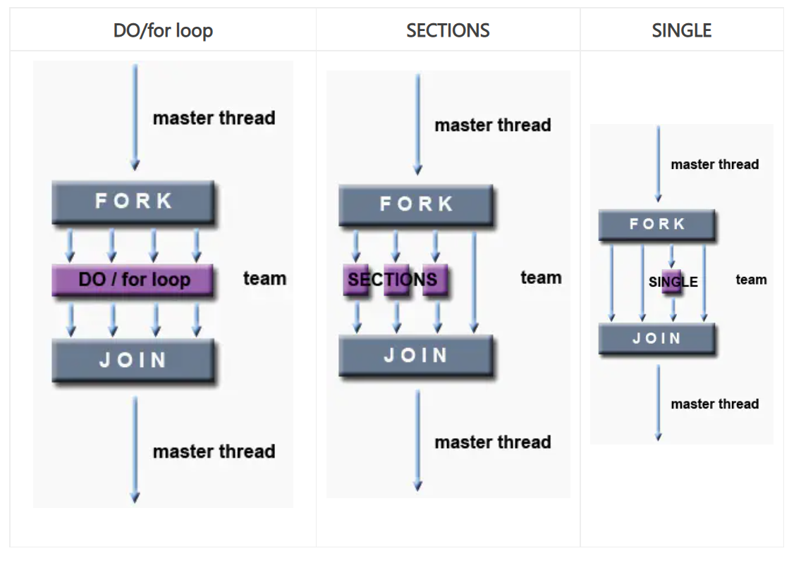

# OpenMP 编译器指令
## 1.C/C++ OpenMP指令格式如下:
| #pragma omp | directive-name | [clause,...] | newline |
|-------------|----------------|--------------|---------|
| 所有OpenMP指令都需要 | 一个有效的OpenMP指令。出现在pragma 之后和任何句子之前 | 可选参数。除非另有限制，子句可以按任何顺序重复 | 必要参数。在此指令所包含的结构化块之前 |

```c++
// 例如：
#pragma omp parallel default(shared) private(beta,pi)
```

**规则**

- 区分大小写
- 指令遵循C/C++编译器指令标准的约定
- 每个指令只能指定一个指令名
- 每个指令最多应用于一个后续语句，该语句必须是一个结构化块
- 长指令可以通过在指令行的末尾使用反斜杠("\")来转义换行符，从而在后续的行中“继续”

## 2.指令范围
>OpenMP为指令如何相互关联(绑定)和嵌套指定了许多范围规则，如果忽略OpenMP绑定和嵌套规则，可能会导致非法或不正确的程序

#### 2.1静态范围
- 在指令后面的结构化块的开始和结束之间以文本形式封装的代码
- 指令的静态范围不跨越多个程序或代码文件

#### 2.2孤立的指令
- 一个OpenMP指令，独立于另一个封闭指令，成为孤立型指令。它存在于另一个指令的静态范围之外
- 将跨越程序和可能的代码文件

#### 2.3动态范围
- 指令的动态范围包括静态范围和孤立指令的范围

## 3.并行区域结构
**并行区域结构是多个线程执行的代码块。是基本的OpenMP 并行结构。**

**格式**
```c++
#pragma omp parallel [caluse ...] newline
                     if (scalar_expression)
                     private (list)
                     shared (list)
                     default (shared | none)
                     firstprivate (list)
                     reduction (operator: list)
                     copyin (list)
                     num_threads (integer-expression)
    structured_block
```

**注意事项**
- 当一个线程执行到一个并行指令时，它创建一个线程组并成为该线程组的主线程
- 从这个并行区域开始，代码被复制，所有的线程都将执行该代码
- 在并行区域的末端有一个隐含的屏障，只有主线程在此之后继续执行
- 如果任何线程在一个并行区域内终止，则团队中所有线程都将终止，并且在此之前所作的工作都将无效

#### 3.1并行区域内有多少线程

并行区域内的线程数由以下因素决定，按优先级排序：

- IF子句的计算
- NUM_THREADS子句的设置
- 使用omp_set_num_threads()库函数
- 设置OMP_NUN_THREADS环境变量
- 实现缺省值 —— 通常是一个节点上的cpu数量，尽管它可以是动态的

注：线程的编号从0到N-1,其中0是主线程的编号

#### 3.2动态线程

- 使用omp_get_dynamic()库函数来确定是否启用了动态线程
- 如果支持使用动态线程的话，可以用以下两种方式：
  1. omp_get_dynamic()库函数
  1. 将OMP_NESTED环境变量设置为TRUE
- 如果不支持，则在另一个并行区域内嵌套一个并行区域，从而在默认情况下创建一个由单个线程组成的新团队

#### 3.3子句

- IF子句: 如果存在，它的值必须为非0，以便创建一个线程组。否则，该区域将由主线程串行执行。
- 关于更多子句请[点击此处]()查看

#### 3.4并行区域的限制条件
- 并行区域必须是不跨多个程序或代码文件的结构化块
- 从一个并行区域转入或转出是非法的
- 只允许一个IF子句
- 只允许一个NUM_THREADS子句
- 程序不能依赖子句的顺序

关于并行区域的例子请[点击此处](../src/OPdemo1.cpp)查看

## 4.工作共享结构

- 工作共享结构将封闭的代码区域的执行划分给遇到它的团队成员
- 工作共享结构不会启动新线程
- 在进入工作共享结构是没有隐含的屏障，但是在工作共享结构的末尾有一个隐含的屏障

#### 4.1 工作共享结构的类型

- **Do/for** 整个团队的循环迭代。表示一种"数据并行性"
- **SECTIONS** 把工作分成单独的、不连续的部分。每个部分由一个线程执行。可以用来实现一种"函数并行性"
- **SINGLE** 序列化一段代码



**注意事项**

- 为了使指令能够并行执行，必须将工作共享结构动态的封装在一个并行区域中
- 团队的所有成员必须遇到工作共享结构，或者根本遇不到
- 团队中的所有成员必须以相同的顺序遇到连续的工作共享结构

##### DO/for指令

>DO/for指令指定紧随其后的循环迭代必须由团队执行。前置条件时已经启动了并行区域，否则它将在单个处理器上串行执行

**格式**
```c++
#pragma omp for [caluse ...] newline
                schedule(type [,chunk])
                ordered
                private (list)
                firstprivate (list)
                lastprivate (list)
                shared (list)
                reduction (operator: list)
                collapse (n)
                nowait
    for_loop
```

关于Do/for指令的实例，请[点击此处](../src/OPdemo2.cpp)查看

**子句**

- schedule: 描述循环迭代如何在团队中的线程之间进行分配。
  - 静态(static): 循环迭代被分成小块，然后静态的分配给线程。如果没有指定chunk，则迭代是均匀地在线程之间连续的划分
  - 动态(dynamic): 循环迭代分成小块，并在线程之间动态调度。当一个线程完成一个块时,它被动态地分配给另一个块，默认大小为1
  - 引导(guided): 当线程请求迭代时, 迭代被动态地分配给块中的线程，知道没有剩余的块需要分配为止。与dynamic类似，只是每次将一个工作包分配给一个线程时，块的大小就会减小
  1. 初始块大小与number_of_iteration / number_of_threads(线程数)成比例
  1. 后续块大小与number_of_iterations_remaining / number_of_threads(线程数)成比例
  1. chunk 参数定义最小块大小。默认为1
- nowait: 如果指定，那么线程在并行循环结束时不会同步
- ordered：指定循环的迭代必须像在串行程序中一样执行
- collapse：指定在一个嵌套循环中有多少个循环应该折叠成一个大的迭代空间，并根据schedule子句进行划分。折叠迭代空间的顺序时确定的，就好像他们时在按顺序执行的一样。可能会提高性能

##### sections指令

>sections指令是一个非迭代的共享工作结构，它指定所包含的代码段将被分配给团队中的各个线程。 section指令嵌套在sections指令中。每个部分由团队中的一个线程执行一次。不同的部分可以由不同的线程执行。

**格式**
```c++
#pragma omp sections [caluse ...] newline
                private (list)
                firstprivate (list)
                lastprivate (list)
                reduction (operator: list)
                nowait
  {
  #pragma omp section newline
    /*code*/
  #pragma omp section newline
    /*code*/
  }
```

关于sections指令的实例，请[点击此处](../src/OPdemo3.cpp)查看