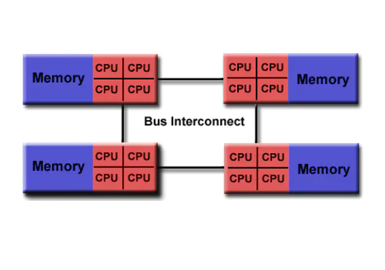

# OpenMP编程模型
## 1.共享内存模型

OpenMP是为了多处理器或多核共享内存机器设计的,其底层架构可以是共享内存UMA或NUMA。

- **UMA(Uniform Memory Access): 一致内存访问**

- **NUMA(Non Uniform Memory Access)[非一致内存访问](https://blog.csdn.net/shulianghan/article/details/123905502?ops_request_misc=%257B%2522request%255Fid%2522%253A%2522167279938916782425114071%2522%252C%2522scm%2522%253A%252220140713.130102334..%2522%257D&request_id=167279938916782425114071&biz_id=0&utm_medium=distribute.pc_search_result.none-task-blog-2~all~sobaiduend~default-1-123905502-null-null.142^v68^control,201^v4^add_ask,213^v2^t3_esquery_v1&utm_term=%E9%9D%9E%E4%B8%80%E8%87%B4%E5%86%85%E5%AD%98%E8%AE%BF%E9%97%AE&spm=1018.2226.3001.4187)**: 有多个CPU处理器,每个 处理器都有自己的独立的本地内存,每个CPU处理器只支持自己的本地内存快速访问,各个 CPU处理器之间通过"总线"连接。

因为OpenMP是为共享内存并行编程而设计的，所以它在很大程度上局限于单节点的并行性。通常节点上处理元素(核心)的数量决定了可以实现多少并行性。

## 2.Fork - Join 模型

OpenMP采用fork-join的执行模式

>开始的时候只存在一个主线程，当需要进行并行计算的时候，派生出若干个分支线程来执行并行任务。并行代码执行完毕后，分支线程汇合，并把控制流程交给单独的主线程。

- **Fork(派生)：** 主线程创建一组并行化执行的线程。
- **Join(合并)：** 当线程完成工作后，它们会进行同步与终止，只剩下主线程。