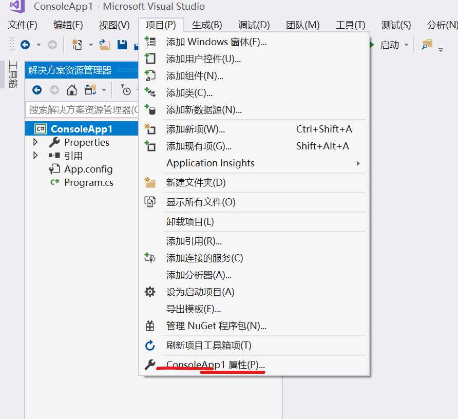
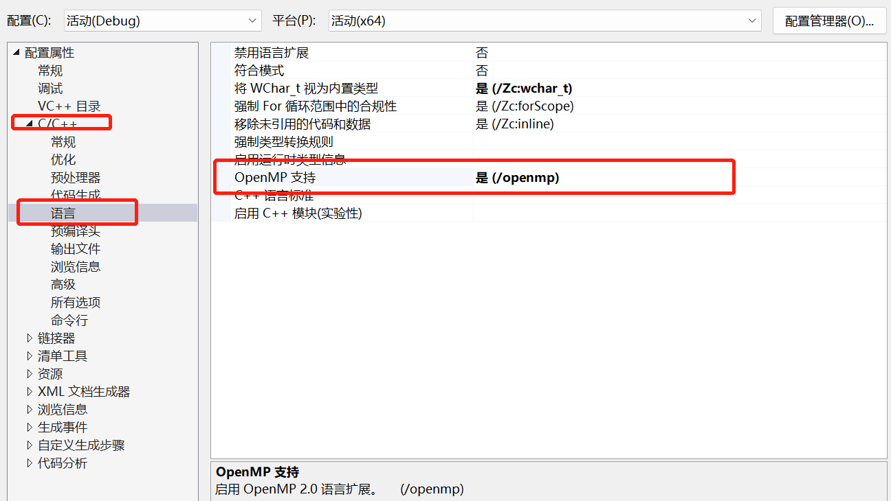

# Liunx环境下编译OpenMP代码
```shell
g++ -fopenmp cpp文件
```

# Windows环境下编译OpenMP代码
vs配置openMP的方法可以参考[这篇博文](https://blog.csdn.net/weixin_43996701/article/details/116501529)

Visual Studio 2017 配置方式如下
**在项目上右键->属性->配置属性->C/C++->语言->OpenMP支持，选择“是”即可。**


