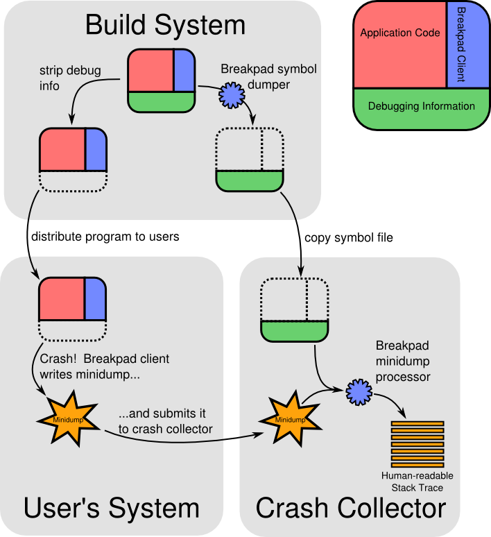

# Breakpad 概述
  

## Breakpad组件
1. 客户端  
客户端是一个库,包含在您的应用程序中。 它可以获取当前线程的状态和当前加载的可执行文件和共享库的ID写转储文件。您可以配置客户端发生了崩溃时写入一个minidump时,或明确要求时。

2. 符号卸载器  
一个程序,读取程序编译时,编译器所产生的调试信息,并生成一个Breakpad格式的调试符号文件。

3. minidump处理器  
读取客户端程序崩溃时生成的minidump文件(错误信息),找到崩溃程序对应版本的调试符号文件(源程序概括),生成一个可读性好的C/C++堆栈跟踪文件。

## 前置概念
1. Core dump  
core是unix系统内核,当程序出现内存越界时,操作系统会中止(kill)当前进程,并将当前的内存状态转储成core文件,它记录了程序挂掉时的详细的状态描述,这样我们可以通过分析core文件找到问题所在。  
core dump又称为核心转储,当程序在运行过程发生异常,操作系统将把程序当前的内存状况存储在一个core文件中,叫做core dump。使用bgd调试器可查看文件详细信息。

2. 调试符号(debug-symbol)格式  
调试符号是编译器在将源文件编译为可执行程序的过程中,为支持调试而摘录的调试信息。这些信息以表格的形式记录在符号表中,是对源程序的概括。调试信息描述目标有变量、类型、函数、符号、源代码行等(函数名或行号,堆栈帧的边界)。  
调试信息时编译过程中逐步收集提炼的,通常情况下是由链接器或专门的工具保存到调试符号文件中,如VS编译器默认将调试符号文件保存到单独的PDB文件,可以使用DbgHelp函数库打开,也可以用DIA SDK。  

## 小型转储文件格式(minidump)
转储文件的格式是由微软开发的类似存储的文件,便于崩溃文件上传。一个minidump文件包含:
* 创建dump的进程加载的可执行文件和共享库列表,包含加载的那些文件的文件名和标识符。
* 程序执行过程中存在的线程列表。对于每个线程转储包括处理器寄存器的状态,线程的堆栈存储器的内容等信息
* 其他系统转储信息:处理器和操作系统版本,转储的原因等

## 核心优势
* minidump轻便易传输
* 兼容跨平台

## 编译使用
1. 创建文件夹

```
mkdir breakpad
cd breakpad
```

2. 下载源码

```
git clone  https://github.com/feifei-123/breakpad
```

breakpad 是跨平台的,支持linux、window和Mac os系统,不同平台上的编译配置也是不同的。
linux 平台编译出来的dump_syms 仅能再linux上运行,来解析linux上运行的so的符号信息
macOS 平台编译出来的dump_syms 仅能再mac OS 上运行,来解析mac 上运行的so的符号信息。
window 平台编译出来的dump_syms,仅能在Window上运行,并解析window上运行的dll的符号信息。

3. 编译生成库

```
# Breakpad 提供了一个 Autotools 构建系统,它将构建 Linux 客户端库和处理器库。
cd breakpad
./configure
make
```

在 ./breakpad/src/client/linux/ 路径下生成libbreakpad_client.a文件(client静态库文件),该库与程序一起编译用于从应用程序中生成minidump文件。  

```
./breakpad/src/client/linux/
libbreakpad_client.a
```

在 ./breakpad/src/tools/linux/dump_syms/ 目录下生成用于提取sym符号文件的可执行程序和.o目标文件还有对应的.cc文件。

```
./breakpad/src/tools/linux/dump_syms/
dump_syms
dump_syms-dump_syms.o
dump_syms.cc
```

在 ./breakpad/src/processor/ 目录下生成用于将minidump文件(.dmp)和调试符号文件(.sym)进行处理合成可读的堆栈信息

```
./breakpad/src/processor/
minidump_stackwalk
minidump_stackwalk.cc
minidump_stackwalk_machine_readable_test
minidump_stackwalk.o
minidump_stackwalk_test
```