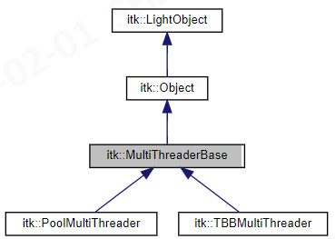
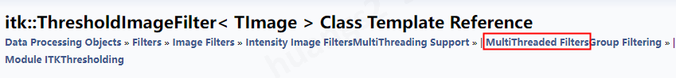
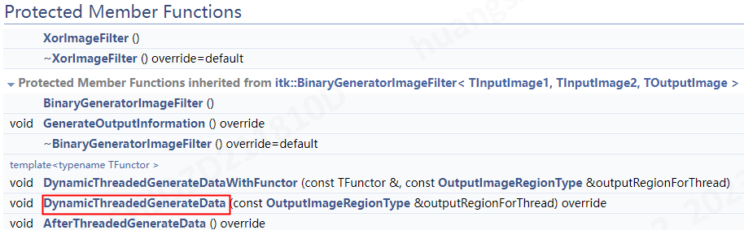
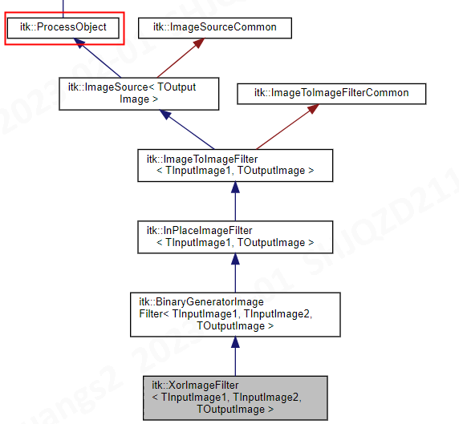

# itk多线程加速

# 1. ITK多线程简介
1.1~1.3部分主要是翻译自以下内容：

ITK的Guide book：<https://itk.org/ItkSoftwareGuide.pdf>，`Part II Architecture`->`SYSTEM OVERVIEW`->`3.2.7 Multi-Threading`

## 1.1 平台多线程
### 1.1.1 基本内容
+ ITK的多线程是通过一个高层的抽象设计解决的，这个方法提供遍历的多线程，同时隐藏了ITK所支持的不同系统的线程实施的复杂性（比如：linux的多线程，windows的多线程，包括不同cpu的多线程等）
+ 例如：`itk::PlatformMultiThreader`这个类直接使用平台特定的语法来执行多线程，例如：Unix类系统的`pthread_create`方法（创建线程的函数）
+ 而`itk::TBBMultiThreader`这个线程类则使用了Intel的TBB库来实现多线程，这个库进行了多线程间的动态负载均衡
+ 所有的`multi-threader`都继承自`itk::MultiThreaderBase`类


在ITK的[itk::MultiThreaderBase](https://itk.org/Doxygen/html/classitk_1_1MultiThreaderBase.html) 类页面中，可以看到有以下继承关系



可以看到，这里另外有两个类是`itk::PoolMultiThreader`和`itk::TBBMultiThreader `。

----
另外，在[itk::MultiThreaderBase](https://itk.org/Doxygen/html/classitk_1_1MultiThreaderBase.html)类中，

其实关于Threader的枚举值，有：`Platform`、`First`、`Pool`、`TBB`、`Last`和`Unknown`这6种。
```cpp
namespace itk
 {  
 class MultiThreaderBaseEnums
 {
 public:
   enum class Threader : int8_t
   {
     Platform = 0,
     First = Platform,
     Pool,
     TBB,
     Last = TBB,
     Unknown = -1
   };
```
可以看到，
+ First就是Platform，默认第一种就是调用每个系统特定的多线程
+ TBB就是Last
+ Pool
+ 所以实际上就只有3种，Platform，Pool和TBB（后两个需要进行额外coding，所以继承了`MultiThreaderBase`类）


```cpp
using ThreaderEnum = MultiThreaderBaseEnums::Threader;
 #if !defined(ITK_LEGACY_REMOVE)
   using ThreaderType = ThreaderEnum;
   static constexpr ThreaderEnum Platform = ThreaderEnum::Platform;
   static constexpr ThreaderEnum First = ThreaderEnum::First;
   static constexpr ThreaderEnum Pool = ThreaderEnum::Pool;
   static constexpr ThreaderEnum TBB = ThreaderEnum::TBB;
   static constexpr ThreaderEnum Last = ThreaderEnum::Last;
   static constexpr ThreaderEnum Unknown = ThreaderEnum::Unknown;
```

### 1.1.2 Intel的TBB
ITK对TBB的支持，详见：[itk::TBBMultiThreader Class Reference](https://itk.org/Doxygen/html/classitk_1_1TBBMultiThreader.html)

关于TBB(线程构建模块（Thread Building Blocks，简称TBB）是Intel公司开发的并行编程开发的工具)，可以参考：
+ [TBB（Intel Threading Building Blocks）学习笔记](https://www.cnblogs.com/skiwnchiwns/p/10343944.html)
+ [tbb简介与使用](https://www.cnblogs.com/baibingqianlan/p/9751830.html)

OpenMP(就是`omp`)是和TBB同类型的工具，可以看看
+ [openmp和TBB的选择](https://www.cnblogs.com/algs/p/15119651.html)
+ [TBB/OpenMP/raw thread三种并发编程的取舍分析](https://blog.csdn.net/yuwei629/article/details/9302343)

## 1.2 典型例子（执行原理）
多线程通常是在算法执行阶段使用，

例如：对于类`itk::ImageSource`（**大部分图像处理filter的父类**），其中的`GenerateData()`方法如下：
```cpp
this->GetMultiThreader()->template ParallelizeImageRegion<OutputImageDimension>(
	this->GetOutput()->GetRequestedRegion(),
	[this](const OutputImageRegionType & outputRegionForThread)
	{ this->DynamicThreadedGenerateData(outputRegionForThread); }, this);
```
这个例子里，
+ 每个线程都会触发衍生类（`itk::ImageSource`的子类）的`DynamicThreadedGenerateData`方法
（例如：[itk::ThresholdImageFilter](https://itk.org/Doxygen/html/classitk_1_1ThresholdImageFilter.html)中就有`DynamicThreadedGenerateData`方法，注意，不是所有的Filter都支持这个方法的）
+ `ParallelizeImageRegion`方法用来将图像分成不重叠的不同区域，用于写操作。
+ `itk::ImageSource`的`GenerateData()`方法将`this`指针传给`ParallelizeImageRegion`，这样`ParallelizeImageRegion`方法就可以更新region处理后的filter的进度了。

> 对于某个filter，如果其可以线程化，
>  + 则它的父类会有1个`GenerateData()`方法，这个方法里会分配输出数据缓冲，生成多个线程，同时为每个线程调用`DynamicThreadedGenerateData()`方法，
> + 每个filter自己要实现`DynamicThreadedGenerateData()`方法，父类实现`GenerateData()`方法

----

如果一个filter执行过程中会涉及一些串行操作，那么除了在`BeforeThreadedGenerateData()`方法中完成初始化，在`AfterThreadedGenerateData()`完成析构操作之外，可以在自己的`GenerateData()`方法中并行多个方法
+ 例如：在`itk::CannyEdgeDetectionImageFilter`的`GenerateData()`方法中
```cpp
::GenerateData()
{
this->UpdateProgress(0.0f);
Superclass::AllocateOutputs();

// 简单的串行计算
this->UpdateProgress(0.01f);

ProgressTransformer progress1( 0.01f, 0.45f, this );
// 计算2阶方向导数
this->GetMultiThreader()->template ParallelizeImageRegion<TOutputImage::ImageDimension>(
this->GetOutput()->GetRequestedRegion(),
[this](const OutputImageRegionType & outputRegionForThread)
{ this->ThreadedCompute2ndDerivative(outputRegionForThread); }
progress1.GetProcessObject());


ProgressTransformer progress2( 0.45f, 0.9f, this );
// 计算第二个导数的梯度
this->GetMultiThreader()->template ParallelizeImageRegion<TOutputImage::ImageDimension>(
this->GetOutput()->GetRequestedRegion(),
[this](const OutputImageRegionType & outputRegionForThread)
{ this->ThreadedCompute2ndDerivativePos(outputRegionForThread); },
progress2.GetProcessObject());

// 更新进度100%
this->UpdateProgress(1.0f);
}
```
+ 当从`GenerateData()`中多次触发`ParallelizeImageRegion`时， `this`要么是空指针`nullptr`，要么是`itk::ProgressTransformer`对象，否则`UpdateProgress`会从0%更新到100%多次。
+ 虽然程序不至于崩溃，但是这样的代码没有明确的意义，执行很confused。
+ 因此，如果要自定义`filter`，那么可以自己评估一下`GenerateData()`中每个部分的执行，构建传递合适的`itk::ProgressTransformer`对象进度。

----

## 1.3 5.X版本之后的变动
ITK 5.0对多线程机制进行了重构，以前是`itk::MultiThreader`，现在添加成为了类的层次结构
+ `itk::PlatformMultiThreader`这个类是对之前的旧类`MultipleMethodExecute `的一个轻量化洁净版本。
+ `SpawnThread`方法被丢弃了（deprecated），不过其中很多东西都移到了`itk::MultiThreaderBase`中
+ 需要使用多线程的类应该通过`MultiThreader`接口，来让调用库的用户可以在运行时灵活选择，同时为适应不同系统的`multi-threader`提供了良好的可扩展性
+ 保留了向后兼容的`ThreadedGenerateData(Region, ThreadId)`方法签名（这个函数的接口和名称没改过），以便已知线程数的filters进行调用。
	+ `方法签名`（method signature），**方法名和形参列表**共同组成方法签名（就是函数头）。
	+ 要使用这个签名，则`filter`需要在进行`Update()`之前，需要触发`this->DynamicMultiThreadingOff()`，由`调用者`或者是`pieline的下游filter`调用。最好的触发`this->DynamicMultiThreadingOff()`的位置，是`filter`的构造器里（初始化的时候触发）
+ 在`image filters`和其他`ProcessObject`的子类中，
	+ `SetNumberOfWorkUnits`方法用来控制并行的程度，当`NumberOfWorkUnits`数量大于线程数时，可以进行负载均衡。在开发者想要限制线程（`threads`）数量的大部分地方，应该使用更改`work units`的方法来进行
	+ `itk::MultiThreaderBase`的`MaximumNumberOfThreads`不应该改变，除非时测试性能、可伸缩性以及分析，或者是调试代码的时候。
+ ITK中关于线程安全的共识是：访问一个类的不同实例（包括方法）都是线程安全的操作；在不同线程里调用同一个实例是不安全的（应该避免）


更多实现层面的了解，可以参考github上的文档：[Multithreading refactored](https://github.com/InsightSoftwareConsortium/ITK/blob/master/Documentation/ITK5MigrationGuide.md#multithreading-refactored)

==可以在这个页面搜索”SetNumberOfWorkUnits“==

----
## 1.4  ITK多线程整体认识
1.4部分主要来自ITK官方文档：[Threading](https://itk.org/Doxygen/html/ThreadingPage.html)

### 1.4.1 基本内容
ITK在设计的时候，就考虑了在多处理器环境下运行。
+ ITK的很多filters都是多线程的
+ 当一个多线程的filter执行时，会自动在共享内存配置的多处理器中划分工作，称为`Filter Level Multithreading`（**过滤器级别的多线程**）
	+ 例如下面的动图：
	+ 多个CPU（处理器）在共享内存中，自动把输入划分到不同处理器中执行，然后再把不同处理器的结果合并，即：过滤器级别的多线程
	 
+ 使用ITK构建的应用，也可以管理自己执行的线程。例如：一个应用可以使用1个线程来处理数据，使用另一个线程处理用户界面，这称为`Application Level Multithreading`（应用级别的多线程）

---
### 1.4.2 过滤器级别的多线程（Filter Level Multithreading）
+ 如果希望一个filter支持多线程，那么与普通单线程需要实现[GenerateData()](https://itk.org/Doxygen/html/classitk_1_1ImageSource.html#adb2c5a1c45808a9c5e25e394ef491156)方法不同，其需要提供[ThreadedGenerateData()](https://itk.org/Doxygen/html/classitk_1_1ImageSource.html#a40d1489ddcb02cc056cfd06853acbd84)方法的实现
+ **filter的父类**会产生多个线程（通常和系统中处理器的数量匹配），会调用每个线程中的`ThreadedGenerateData()`方法，来指定输出中每个线程负责生成的部分。
+ 例如：对于一个有两个处理器（可以开两个线程）的计算机来说，则一个图像处理filter可以产生两个线程，每个处理线程负责生成结果的一半，同时每个线程只能写输出图像中对应的那部分。
+ 注意：`entire`输入和`entire`输出图像（指的是`GenerateData() `方法可得的图像，可以查看`Streaming`部分的讨论）在每次`ThreadedGenerateData()`方法的调用中都是可得的。
+ 每个线程都可以读取输入图像的所有部分，但是每个线程只能在自己被规定好的输出图像的部分进行写操作。
+ 输出图像在内存中占用一个连续的块，所有的处理线程都可以使用这个内存。每个线程都被分配了自己要在输出中负责生成的那部分像素，所有的线程都可以向这个内存块进行写入，但是每个线程只能写设置好的那部分像素

### 1.4.3 内存管理（Memory Management）
+ `GenerateData()`方法用于输出块数据的分配，对于图像处理filter来说，相当于对输出图像对象上调用`Allocate()`。
+ 如果一个**filter是多线程**的，那么它不需要提供`GenerateData()`方法，但是需要提供`ThreadedGenerateData()`方法。这个`filter的父类`的`GenerateData()`方法会对输出块数据进行`分配`，并为每个线程调用`ThreadedGenerateData() `方法
+ 如果一个**filter不是多线程**的，那么它必须提供自己的`GenerateData()`方法，`自己分配`输出块数据（比如：对一个输出图像对象调用`Allocate()`方法）

## 1.5 GenerateData()和ThreadedGenerateData()、DynamicThreadedGenerateData()
### 1.5.1 GenerateData()
`GenerateData()`函数的[说明文档](https://itk.org/Doxygen/html/classitk_1_1ImageSource.html#adb2c5a1c45808a9c5e25e394ef491156)
+ 每个图像处理`filter`都有自己的`GenerateData()`函数。主要作用是：通过多线程来把图像处理分成多个部分
+ 缓冲区在这个方法里进行分配。
+ 接下来调用`ThreadedGenerateData()`方法（如果提供了的话）。
+ 然后会生成很多线程，每个线程都会调用`DynamicThreadedGenerateData()`方法
+ 当所有线程都完成处理后，调用`AfterThreadedGenerateData()`方法（如果提供了的话）
+ 如果一个图像处理`filter`不能被线程化，则这个filter需要提供`GenerateData()`实现，用于分配输出缓冲区，
+ 如果一个图像处理`filter`可以被线程化，那么就不应该提供`GenerateData`，而是提供`DynamicThreadedGenerateData() `

### 1.5.2 ThreadedGenerateData()和DynamicThreadedGenerateData()
这两个函数其实作用是类似的，属于历史遗留问题。在**1.3部分 5.X版本之后的变动**中，提到了：
+ 保留了向后兼容的`ThreadedGenerateData(Region, ThreadId)`方法签名（这个函数的接口和名称没改过），以便已知线程数的filters进行调用。
+ 即`ThreadedGenerateData`和`DynamicThreadedGenerateData`的区别仅在于：前者已知线程数，后者需要动态确认线程数
	可以看到，这两个函数的函数头，前者需要传入线程id参数，后者不需要。
	```cpp
	ThreadedGenerateData()
	template<typename TOutputImage>
	virtual void itk::ImageSource< TOutputImage >::ThreadedGenerateData	(const OutputImageRegionType & 	region,
																		 ThreadIdType threadId )	
	
	DynamicThreadedGenerateData()
	template<typename TOutputImage>
	virtual void itk::ImageSource< TOutputImage >::DynamicThreadedGenerateData(const OutputImageRegionType & outputRegionForThread	)	
	```

---
`ThreadedGenerateData()`的[说明文档](https://itk.org/Doxygen/html/classitk_1_1ImageSource.html#a40d1489ddcb02cc056cfd06853acbd84) 和`DynamicThreadedGenerateData`的[说明文档](https://itk.org/Doxygen/html/classitk_1_1ImageSource.html#a33ccffad80a3d0d24384c79927642630) ，内容基本一样，看其中一个就行
+ 如果一个图像处理`filter`可以作为多线程实施，那么这个`filter`需要提供`ThreadedGenerateData() `或者`DynamicThreadedGenerateData()`的实现。
	+ 由这个图像`filter`的父类对输出图像进行划分，产生多个线程，在每个线程中调用`(Dynamic)ThreadedGenerateData()`。
	+ 生成线程之前，会调用`BeforeThreadedGenerateData()`
	+ 当所有线程处理完成后，会调用`AfterThreadedGenerateData()`方法
+ 如果一个图像处理`filter`不支持线程化，则这个`filter`需要实现`GenerateData()`方法而不是`(Dynamic)ThreadedGenerateData()`。
	+ 如果实现了`GenerateData()`，那么这个`filter`就会对输出数据进行分配
	+ 如果一个`filter`实现的是` (Dynamic)ThreadedGenerateData()`，则**输出的内存分配是由其父类自动进行**，每个线程的` (Dynamic)ThreadedGenerateData() `方法只会生成`outputThreadRegion`参数明确的那部分输出，是无法对输出的其他部分内容进行写操作的（其他部分是其他线程负责的）


`DynamicThreadedGenerateData()`是没有`threadId`参数的`ThreadedGenerateData()`方法的一个新的变体，推荐优先使用这个方法，同时这个方法也是默认调用的方法。
+ 作用是：根据当前点多处理器负载，将请求的区域划分为多个部分，来获得更好的负载均衡。
+ 过去的非动态版本，即` ThreadedGenerateData()`函数头包含`threadId`参数，需要被划分的数量是提前知道的，
	+ 如果想使用`ThreadedGenerateData`方法，需要在派生类的构造函数中通过调用` this->DynamicMultiThreadingOff()`来激活。
	+ 适用于以下场景：当多线程算法需要预分配一些数据（数据的大小取决于分块的数量，这里的分块，英语上表述是：pieces /chunks/work units，或者不太正确的描述成threads），、
	+ 只有`PlatformMultiThreader `可以保证每个块在自己专属的线程中进行处理。`Pool  and TBB multi-threaders`这两种会自己维护一个线程池（通常等于处理器核的数量）来处理块，可能会造成单个线程被用来处理多个块。

# 2. 支持多线程加速的Filter（开发者须知）
>**[MultiThreaded Filters](https://itk.org/Doxygen/html/group__MultiThreaded.html)页面，这里记录的就是ITK已经实现好的支持多线程的Filter**
## 2.1 基础内容
首先要知道哪些Filter是支持多线程的，并不是所有的Filter都支持多线程，如果不支持，调用
```cpp
someFilter->SetNumberOfWorkUnits()
someFilter->SetMaximumNumberOfThreads()
```
其实是没有意义的。

---
上面说过 [itk::ThresholdImageFilter](https://itk.org/Doxygen/html/classitk_1_1ThresholdImageFilter.html)中就有`DynamicThreadedGenerateData`方法，即支持多线程
	
+ 可以看到这样的分类，点击`MultiThreaded Filters`，**跳转到[MultiThreaded Filters](https://itk.org/Doxygen/html/group__MultiThreaded.html)页面，这里记录的就是ITK已经实现好的支持多线程的Filter**
+ 常用的`itk::MultiScaleHessianBasedMeasureImageFilter`，这个[类的页面](https://itk.org/Doxygen/html/classitk_1_1MultiScaleHessianBasedMeasureImageFilter.html)搜索`thread`就什么都搜不到，所以filter能否多线程其实与其实现的原理有关，对于这个filter来说，可能大部分都是串行操作？？？
+ 常用的`itk::OtsuMultipleThresholdsImageFilter`，是支持多线程的，[itk::OtsuMultipleThresholdsImageFilter的文档](https://itk.org/Doxygen/html/classitk_1_1OtsuMultipleThresholdsImageFilter.html)。这个页面可以搜到`GenerateData()`函数，所以这其实是个父类


## 2.2 父类和子类示例
在`GenerateData()`函数的[说明文档](https://itk.org/Doxygen/html/classitk_1_1ImageSource.html#adb2c5a1c45808a9c5e25e394ef491156)、`ThreadedGenerateData()`的[说明文档](https://itk.org/Doxygen/html/classitk_1_1ImageSource.html#a40d1489ddcb02cc056cfd06853acbd84) 和`DynamicThreadedGenerateData`的[说明文档](https://itk.org/Doxygen/html/classitk_1_1ImageSource.html#a33ccffad80a3d0d24384c79927642630) 中，都有类似下面的内容。
```cpp 
Reimplemented in itk::MRIBiasFieldCorrectionFilter< TInputImage, TOutputImage, TMaskImage >, ....
```

但是不难发现，`DynamicThreadedGenerateData`的[说明文档](https://itk.org/Doxygen/html/classitk_1_1ImageSource.html#a33ccffad80a3d0d24384c79927642630) 中的内容，和多线程的filter列表：[MultiThreaded Filters](https://itk.org/Doxygen/html/group__MultiThreaded.html)中并不完全一致。

---
以[MultiThreaded Filters](https://itk.org/Doxygen/html/group__MultiThreaded.html)中的`itk::XorImageFilter`为例，
+ [itk::XorImageFilter的文档](https://itk.org/Doxygen/html/classitk_1_1XorImageFilter.html)，文档中可以搜索到`DynamicThreadedGenerateData`：
	 
  同时可以看到其类的层级结构
  
  在[itk::ProcessObject Class Reference](https://itk.org/Doxygen/html/classitk_1_1ProcessObject.html)中，可以搜到`GenerateData ()`，也就是可以作为父类。

## 2.3 SetNumberOfWorkUnits和SetMaximumNumberOfThreads
参考github上的文档：[Multithreading refactored](https://github.com/InsightSoftwareConsortium/ITK/blob/master/Documentation/ITK5MigrationGuide.md#multithreading-refactored)可知：

+ `Get/SetGlobalMaximumNumberOfThreads()`和`GlobalDefaultNumberOfThreads()`现在位于`itk::MultiThreaderBase`中。
	但是要注意，这几个函数仍然可以保留在`itk::PlatformMultiThreader`中
	
	[itk::MultiThreaderBase](https://itk.org/Doxygen/html/classitk_1_1MultiThreaderBase.html)的文档页面包含以下相关的函数：
	```cpp
	# Public Member Functions
	virtual void 	SetMaximumNumberOfThreads (ThreadIdType numberOfThreads)
	virtual ThreadIdType 	GetMaximumNumberOfThreads () const
	virtual void 	SetNumberOfWorkUnits (ThreadIdType numberOfWorkUnits) 
	virtual ThreadIdType 	GetNumberOfWorkUnits () const
 	
	# Static Public Member Functions
	static void 	SetGlobalMaximumNumberOfThreads (ThreadIdType val)
 	static ThreadIdType 	GetGlobalMaximumNumberOfThreads ()
 	static void 	SetGlobalDefaultNumberOfThreads (ThreadIdType val)
	static ThreadIdType 	GetGlobalDefaultNumberOfThreads ()
	```	
+ `GetGlobalDefaultNumberOfThreadsByPlatform()`方法已经从`itk::ThreadPool`移动到了`itk::MultiThreaderBase`中
+ 对于图像filters和其他`itk::ProcessObject`的派生类来说，`SetNumberOfThreads`已经改名为`SetNumberOfWorkUnits`. 
	+ 在[itk::ProcessObject Class Reference](https://itk.org/Doxygen/html/classitk_1_1ProcessObject.html)，可以看到`SetNumberOfWorkUnits`方法的说明：设置执行时的work units的数量（把输出分成几块，一般和处理器数量对应）
+ 对于`itk::MultiThreaderBase` 及其派生类, `SetNumberOfThreads`被分成了`SetMaximumNumberOfThreads`和`SetNumberOfWorkUnits`， 在[itk::MultiThreaderBase](https://itk.org/Doxygen/html/classitk_1_1MultiThreaderBase.html)，可以看到这两个方法的说明
	+ `SetMaximumNumberOfThreads()`：设置要使用的线程数量，是个大于1的整数，调用的时候也要确认一下是不是可以接受这个设置。
	+ `SetNumberOfWorkUnits()`：设置要创建的work units数量，是个大于1的整数，所以调用时要确认是否可以负荷这个数量
+ 当`NumberOfWorkUnits `大于线程数时，可以进行负载均衡。
	+ 以前常见的`innerFilter->SetNumberOfThreads(1)`，现在可以改成`innerFilter->SetNumberOfWorkUnits(1)`。即：之前用线程(threads)操作的地方，现在都换成工作单元(work units)
+ 如果要保证你的写的类（一般都是自己写`filter`）和旧的代码兼容，即编译ITK的时候开启了`ITKV4_COMPATIBILITY`，则需要在`filter`的构造器里进行`this->DynamicMultiThreadingOn()`
+ 变量 `ITK_MAX_THREADS` 和`ITK_DEFAULT_THREAD_ID`现在都位于` itk:: namespace`中，使用下面的方法可以向后兼容：

```cpp
	using itk::ITK_MAX_THREADS;
	using itk::ITK_DEFAULT_THREAD_ID;
```

# 3. 实验
## 3.1 代码和结果
```cpp
#include <itkMultiThreaderBase.h>

itk::MultiThreaderBase::SetGlobalDefaultUseThreadPool(true);
itk::MultiThreaderBase::SetGlobalDefaultNumberOfThreads(32);
// 本机（Windows 10）8核，逻辑CPU 16，最多可以支持16个线程，所以这里设置32其实没有意义
// 不设置的话，默认就是本机支持的全部线程数量

yourFilter->SetNumberOfWorkUnits(1);
// 设置输入的图像要分成的块数，一般要和线程数对应，不设置的话，默认是4倍的线程数
// 可以先去搜一下 这个filter是不是继承了itk::ProcessObject，可以在   Public Member Functions inherited from itk::ProcessObject这里面找找，是不是有`SetNumberOfWorkUnits`这个函数
std::cout<<"Default GlobalDefaultNumberOfThreads is :"<<itk::MultiThreaderBase::GetGlobalDefaultNumberOfThreads()<<std::endl;
std::cout<<"objectnessFilter Work Units num: "<< objectnessFilter->GetNumberOfWorkUnits()<<std::endl;
```

## 3.2 结论
和discourse：[More Threading issue](https://discourse.itk.org/t/more-threading-issue/438)这个讨论的结果差不多：
+ ITK在创建线程池时，会使用系统的最大线程数
+ 同时，默认数据分块（work units）的数量是线程数×4

所以即便代码里什么都不加，其实ITK已经调用了当前系统默认的多线程了。
+ 如果希望进一步提速，可能要去看看TBB等专门的库吧