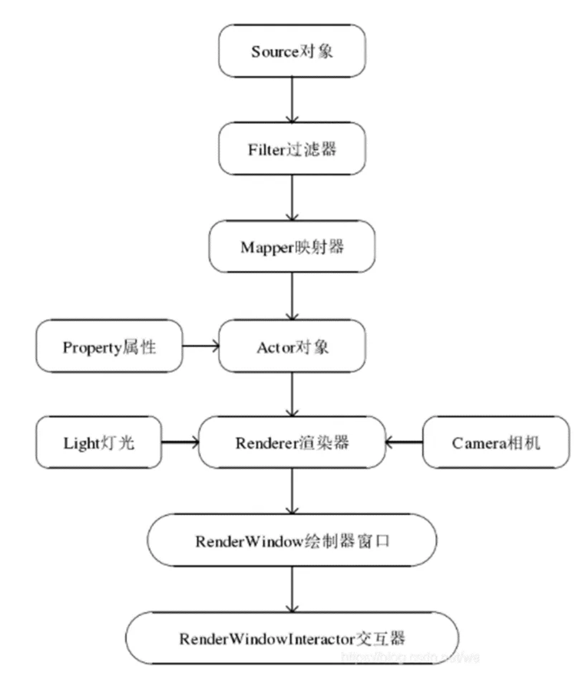

# VTK
## 知识
### 概念
* [vtk基础](https://www.zhihu.com/column/c_1406939506679951360)
* [数据对象、管道架构、渲染子系统](https://blog.csdn.net/charce_you/article/details/93486241)
* [功能模块](https://blog.csdn.net/charce_you/article/details/93486758)
* [图形模型和可视化模型](https://blog.csdn.net/charce_you/article/details/91637379)
* [基本数据结构](https://blog.csdn.net/deepsprings/article/details/107942471)
* [着色器和图形管道](https://blog.csdn.net/charce_you/article/details/91345079)
* [相机](https://blog.csdn.net/charce_you/article/details/91315507)
* 图像渲染的基本流程


### 对象
* [基础对象](https://blog.csdn.net/charce_you/article/details/93657792)
* [数据类](https://blog.csdn.net/charce_you/article/details/94427418), [基本数据结构之数据对象和数据集](https://blog.csdn.net/webzhuce/article/details/72615468)
* [Mapper](https://blog.csdn.net/charce_you/article/details/94627490)
* [演员类](https://blog.csdn.net/charce_you/article/details/94427411)
* [窗口类](https://blog.csdn.net/charce_you/article/details/93659023)
* 拍摄举例，Actor通过vtkCommand处理事件

| 项 | 定义 | 例子里的定义 | 例子里的物品 | 和下层的关系 |
| - | - | - | - | - |
| Data/Source | 各类数据 | 准备拍摄的原材料 | 石头、布 | 1:1 |
| Mapper | 数据转换成图像数据的映射 | 把原材料转换成拍摄对象 | 道具师用石头布景，服装师把布做成衣服 | 1:1 |
| Actor | 执行渲染mapper的对象 | 拍摄对象 | 人物角色，桥 | 1:N |
| Render | 渲染器 | 拍摄结果 | 摄像头、灯光 | 1:N |
| RenderWindow | 渲染成像的平面窗口 | 导演电脑，一个窗口可以看到每个拍摄结果 |  | / |
| RenderWindowInteractor | 在渲染窗口上的交互(鼠标，键盘事件)，提供了独立于平台的与渲染窗口进行交互的机制 | 导演和每个拍摄结果交互 |  | / |

### 纹理
* [纹理](https://blog.csdn.net/charce_you/article/details/91635577)
* [纹理贴图](https://blog.csdn.net/charce_you/article/details/97948687)

### 渲染
* [渲染六步](https://zhuanlan.zhihu.com/p/375918788)

## 编译
### 集成EGL
```
git clone https://gitlab.kitware.com/vtk/vtk.git && cd vtk && git checkout v8.2.0
mkdir /app/vtk_install && mkdir build && cd build
// 重点是-DVTK_USE_X=OFF -DVTK_OPENGL_HAS_EGL=ON -DVTK_OPENGL_HAS_OSMESA=OFF
cmake -DCMAKE_INSTALL_PREFIX=/app/vtk_install -DCMAKE_BUILD_TYPE=Release -DBUILD_SHARED_LIBS=ON -DBUILD_EXAMPLES=OFF -DBUILD_TESTING=OFF -DVTK_Group_Views=ON -DModule_vtkRenderingParallel=ON -DVTK_Group_Rendering=ON -DVTK_Group_StandAlone=ON -DVTK_USE_X=OFF -DVTK_OPENGL_HAS_EGL=ON -DVTK_OPENGL_HAS_OSMESA=OFF -DVTK_RENDERING_BACKEND=OpenGL2 -DVTK_DEFAULT_RENDER_WINDOW_OFFSCREEN=ON
make -j8 && make install
```

## 开发
* [教程1](https://blog.csdn.net/weixin_41755306/category_11615855.html), [教程2](https://blog.csdn.net/charce_you/category_9016041.html), [VTK基础及应用开发教程](https://blog.csdn.net/www_doling_net/article/details/8763686)
* [vtk.js](https://juejin.cn/post/6854573220121542670)
* [VTK智能指针](https://blog.csdn.net/WU9797/article/details/107854988) : 与其他智能指针不同之处在于引用计数保留在VTK对象本身中，而不是智能指针类中。这样的好处在于：即使VTK对象作为原始指针传递，也可以增加引用计数。
* [VTK初始化](https://blog.csdn.net/shenziheng1/article/details/54838394)：否则会出现Warning: Link to vtkInteractionStyle for default style selection
```
#include <vtkAutoInit.h>
VTK_MODULE_INIT(vtkRenderingOpenGL2);
VTK_MODULE_INIT(vtkInteractionStyle);
VTK_MODULE_INIT(vtkRenderingFreeType);
VTK_MODULE_INIT(vtkRenderingVolumeOpenGL2);
```

### demo
* [STL文件](https://server.php1.cn/detail/vtk_ShiZhan_-_Sh_e1895aa1.html)
* [mha文件](https://codeantenna.com/a/grbNCqaiyt)
