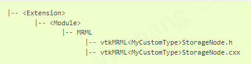

# MRML 概览
> 本文仅作学习研究分享使用- 原文地址 https://slicer.readthedocs.io/en/latest/developer_guide/mrml_overview.html

## 介绍
Medical Reality Modeling Languague(MRML) 医学现实建模语言, 是一种用来描述医疗软件中数据的数据模型。

* MRML软件库： 一个开源的软件库，包含MRML数据在内存中的存储格式，文件读写，可视化，处理框架和用来查看和编辑数据的UI视图。
软件库基于VTK，使用ITK来读写一部分的文件格式，还依赖于一些其他软件，如使用QT来构建GUI。这个软件库是独立于Slicer的，所以可以被应用于任何其他的医疗软件应用。目前Slicer是唯一的使用MRML的应用程序。所以MRML的代码包含在Slicer的代码仓库。

* MRML文件：当一个MRML数据被存储到文件时，会创建一个XML文件（扩展名为.mrml）， 包含所有数据集合的目录。也可能包括其他文件的引用信息，用于批量数据存储。这种文件格式的一个变种是MRML捆绑文件，它包含了.mrml文件和所有引用的数据文件在一个压缩文件中（扩展名为.mrb)。

## MRML 场景
* 所有的数据都存储在一个MRML场景中，其中包含一个MRML节点的列表。
* 每个MRML节点在场景中都有一个唯一的ID，有一个名称、自定义属性（键：值对），以及一些额外的属性来存储其数据类型的特定信息。节点类型包括体数据、表面网格、点集、转换等。
* 节点之间可以保持相互的引用（链接）。
* 节点可以在其内容或内部状态改变时调用事件。最常见的事件是 "修改 "事件，每当节点的内容发生变化时，它就被调用。其他节点、应用逻辑对象或用户界面部件可以添加观察者，这些观察者是回调函数，每当相应的事件被调用时就会执行。

## MRML节点
### 基础MRML节点类型
* **数据节点** 存储了一个数据集的基本属性。由于同一个数据集可以用不同的方式显示（即使在同一个应用程序中，你可能想在每个视图中以不同的方式显示同一个数据集），所以显示属性不存储在数据节点中。同样地，同一个数据集可以以不同的文件格式存储，因此文件存储属性不存储在数据节点中。数据节点通常是VTK对象的薄包装，如vtkPolyData、vtkImageData、vtkTable。最重要的Slicer核心数据节点有以下几个：
  * **Volume**（vtkMRMLVolume及其子类）：存储一个三维图像。卷的每个体素可以是一个标量（用于存储具有连续灰度值的图像，如CT图像）、标签（用于存储离散的标签，如分割结果）、矢量（用于存储位移场或RGB彩色图像）或张量（MRI扩散图像）。二维图像卷被表示为单片三维卷。4D卷被存储在序列节点（vtkMRMLSequenceNode）中。
  * **Model**（vtkMRMLModelNode）：存储一个表面网格（多边形元素、点、线等）或体积网格（四面体、楔形元素、非结构网格等）。
  * **Segmentation**（vtkMRMLSegmentationNode）：复杂的数据节点，可以存储图像分割（也被称为轮廓，标签）。它可以在内部存储多种表现形式，例如，它可以同时存储二进制标签图图像和封闭表面网格。
  * **Markups**（vtkMRMLMarkupsNode和子类）：存储简单的几何对象，如点列表（以前称为 "基准点列表"）、线、角、曲线、用于注释和测量的平面。
  * **Transform**（vtkMRMLTransformNode）：存储可以应用于任何可转换节点的几何转换。一个变换可以包含任何数量的线性或非线性（翘曲）变换链。一般来说，建议使用vtkMRMLTransformNode。子类型（vtkMRMLLinearTransformNode、vtkMRMLBSplineTransformNode、vtkMRMLGridTransformNode）被保留下来，以便向后兼容，并允许在用户界面部件中过滤特定的变换类型。
  * **Text**（vtkMRMLTextNode）：存储文本数据，如配置文件、描述性文本等。
  * **Table** (vtkMRMLTableNode): 存储表格数据（多个标量或向量数组），主要用于在表格和图中显示定量结果。
* **显示节点** （vtkMRMLDisplayNode及其子类）指定如何显示数据节点的属性。例如，一个模型节点的颜色被存储在一个与模型节点相关的显示节点中。
  * 可以为一个数据添加多个显示节点，每个节点指定不同的显示属性和视图节点。内置的Slicer模块通常只显示并允许编辑与数据节点相关的第一个显示节点。
  * 如果一个显示节点指定了一个视图节点的列表，那么相关的数据节点就只在这些视图中显示。
  * 显示节点可以引用颜色节点来指定一个颜色列表或颜色查询表
  * 当一个数据节点被创建后，可以通过调用其CreateDefaultDisplayNodes()方法来添加默认的显示节点。在某些情况下，Slicer会检测是否缺少显示和存储节点，并尝试创建一个默认节点，但开发者不应该依赖这种错误恢复机制。
* **存储节点** （vtkMRMLStorageNode及其子类）指定如何在文件中存储一个数据节点。它可以存储一个或多个文件名、压缩选项、坐标系信息等
  * 可以通过调用一个数据节点的CreateDefaultStorageNode()方法为其创建默认存储节点。
* **视图节点**（vtkMRMLAbstractViewNode和子类）指定视图的布局和外观，如背景颜色。与视图节点相关的其他节点包括：
  * vtkMRMLCameraNode存储三维视图的相机属性。
  * vtkMRMLClipModelsNode定义了如何用分片平面来剪辑模型。
  * vtkMRMLCrosshairNode存储视图十字线的位置和显示属性（在切片或三维视图中移动鼠标时按住Shift键来定位），同时也提供当前鼠标指针在任何时间的位置。
  * vtkMRMLLayoutNode定义了当前的视图布局：哪些视图（切片、三维、表格等）被显示在哪里。除了在内置视图布局之间切换外，还可以使用XML描述来指定自定义视图布局。
  * vtkMRMLInteractionNode指定查看器的交互模式（视图/变换、窗口/水平、位置标记），例如用户在视图中点击会发生什么
  * vtkMRMLSelectionNode存储场景的全局状态信息，如正在放置的活动标记、场景中使用的单位（长度、时间等）等等。
* **Plot节点** 指定如何将表节点的内容显示为图。Plot series节点使用表格节点的一列或两列来指定一个数据系列。绘制图表节点指定了要绘制的系列和方式。绘图视图节点指定在视图中显示哪个绘图图，以及用户如何与之互动。
* **主题层次结构节点**（vtkMRMLSubjectHierarchyNode）允许将数据节点组织成文件夹。主题层次结构文件夹可以与显示节点相关联，它可以用来覆盖该文件夹中所有子节点的显示属性。它取代了以前所有的层次结构管理方法，如模型或注释层次结构。
* **序列节点** 存储了一个数据节点的列表，用来表示场景中的时间序列或其他多维数据集。序列浏览器节点指定哪一个内部数据节点应该被复制到场景中，这样它就可以被显示或编辑。代表内部场景的一个节点的节点被称为代理节点。当一个代理节点在场景中被修改时，所有的修改都可以被保存到内部场景中。

一组存储核心Slicer Module状态的的核心MRML节点如下所示：

MRML API的详细文档可以在[这里](https://apidocs.slicer.org/main/classes.html)找到。

### MRML 节点属性
MRML节点可以将自定义属性作为（属性名称和值）对来存储，这允许在节点中存储额外的应用特定信息，而不需要创建新的节点类型。

为了避免名称冲突，为节点添加属性的自定义模块应该在属性名称前加上模块的名称和'.'字符。例如：DoseVolumeHistogram模块可以使用DoseVolumeHistogram.StructureSetName、DoseVolumeHistogram.Unit、DoseVolumeHistogram.LineStyle等属性名称。

MRML节点属性也可以在用户界面的MRML节点选择器部件中使用过滤标准。

### MRML节点引用
MRML节点可以使用节点引用API来引用和观察其他MRML节点。一个节点可以引用多个节点，每个节点执行一个不同的角色，每个节点由一个独特的字符串来寻址。相同的角色名称可以用来引用多个节点。

节点引用用于例如将数据节点连接到显示和存储节点，模块可以添加更多的节点引用而不改变引用或被引用的节点。

更多细节讨论在[这里](https://www.slicer.org/wiki/Documentation/Nightly/Developers/MRML/NodeReferences)。


### MRML 事件和观察者
* MRML场景和单个节点的变化通过VTK事件和命令-观察者机制传播到其他观察节点、GUI和逻辑对象。
* `vtkSetMacro()`自动调用`ModifiedEvent`。其他事件可以用`InvokeEvent()`方法调用。
* 使用`AddObserver()`/`RemoveObserver()`方法很繁琐且容易出错，因此建议使用`EventBroker`和`vtkObserverManager`辅助类、宏和回调方法来代替。
  * MRML观察者的宏定义在Libs/MRML/vtkMRMLNode.h中。
  * `vtkSetMRMLObjectMacro` - 将MRML节点与另一个vtk对象（另一个MRML节点、逻辑或GUI）注册。没有添加观察者。
  * `vtkSetAndObserveMRMLObjectMacro` - 注册MRML节点并为`vtkCommand::ModifyEvent`添加一个观察者。
  * `vtkSetAndObserveMRMLObjectEventsMacro` - 注册MRML节点并为指定的事件集添加一个观察者。
  * `SetAndObserveMRMLScene()`和`SetAndObserveMRMLSceneEvents()`方法在GUI和逻辑中用来观察Modify、NewScene、NodeAdded等事件。
  * `ProcessMRMLEvents()`方法应该在MRML节点、Logic和GUI类中实现，以便处理来自观察节点的事件。

    

## MRML进阶
### 参数节点
参数节点是MRML节点的一种特殊用法，用于存储特定函数/模块的参数。更多信息见[参数节点](https://slicer.readthedocs.io/en/latest/developer_guide/parameter_nodes.html#parameter-nodes)。

### 场景撤销/重做
MRML Scene提供了Undo/Redo机制，可以恢复场景和单个节点的先前状态。默认情况下，撤消/重做是禁用的，并且不在用户界面上显示，因为它增加了内存的使用，并且没有经过彻底的测试。

基本机制：
* 撤销/重做是基于保存和恢复场景中MRML节点的状态。
* MRML场景可以将所有节点的快照保存到一个特殊的Undo和Redo堆栈中。
* 撤消和重做堆栈存储了从上一个快照中改变的节点的副本。没有变化的节点是通过引用（指针）来存储的。
* 当在场景中调用撤消时，撤消堆栈的当前状态被复制到当前场景中，也被复制到重做堆栈中。
* 所有可撤销的操作必须将其数据存储为MRML节点。
  
开发者通过调用MRML场景的SaveStateForUndo()方法来控制快照在什么时候被保存。SaveStateForUndo()保存了场景中所有节点的状态。在改变MRML节点的状态之前，应该在GUI/Logic类中调用SaveStateForUndo()。这通常是在ProcessGUIEvents方法中完成的，该方法处理来自用户与GUI部件交互的事件。SaveStateForUndo()不应该在处理瞬时事件时被调用，例如在拖动滑块时由KW UI发送的连续事件（例如vtkKWScale::ScaleValueStartChangingEvent）。

MRML场景中的下列方法被用来管理撤消/恢复堆栈：
* vtkMRMLScene::Undo() 恢复先前保存的MRML场景的状态。
* vtkMRMLScene::Redo() 可以恢复MRML场景中先前未完成的状态。
* vtkMRMLScene::SetUndoOff() 忽略了下面的 SaveStateForUndo 调用（当对场景/节点进行多次修改而不需要撤销时很有用）。
* vtkMRMLScene::SetUndoOn() 启用以下 SaveStateForUndo 调用。
* vtkMRMLScene::ClearUndoStack() 清除撤销历史。
* vtkMRMLScene::ClearRedoStack() 清除重做历史。
  
### 创建自定义MRML节点类
如果你通过扩展或甚至更新核心来为3D Slicer添加新的功能，大多数时候现有的MRML节点已经足够了。许多强大的C++和Python扩展只是使用和结合现有的节点类型来创建新的功能。其他的扩展，不是从头开始创建新的MRML节点，而是从现有的节点派生出来，只需添加一些方法就可以获得所需的功能。也就是说，如果现有的MRML节点没有提供足够的（或几乎足够的）功能来实现需要做的事情，那么只要花点功夫就可以创建自定义的MRML节点类。

有许多不同的MRML节点和辅助类可以被实现，以实现新的MRML数据类型功能。这里有一个不那么简短的列表。我们将详细介绍其中的每一个。

1. Data node
1. Display node
1. Widget
1. Widget Representation
1. Displayable Manager
1. Storage node
1. Reader
1. Writer
1. Subject Hierarchy Plugin
1. Module

虽然从技术上讲，使一个新的MRML类型能够被使用和有用并不需要所有这些都被实现，但实现所有这些将产生最好的结果。由此产生的MRML类型将 "像模型一样"，并将通过提供相关的提示来简化未来的维护工作。

`注意`

MRML的节点是用C++实现的。
MRML节点可以在Slicer扩展中实现。

### 规范
对于文件名和类，用你的类型的名字替换&lt;MyCustomType&gt;。

### 数据节点

数据节点是新的MRML类型的本质所在。它是实际数据所在的地方。值得注意的是，数据节点中没有任何关于数据应该如何显示或存储在磁盘上的描述。

文件结构：


要点：

* 类的命名规则： vtkMRML&lt;MyCustomType&gt;Node
  * 例如：vtkMRMLModelNode
* 如果它将被显示在三维或切片视图中，则继承自vtkMRMLDisplayableNode。
* 构建一个新的节点：
  * 声明 `vtkMRMLNode* CreateNodeInstance() override` 和 `vtkMRMLYourNodeType *New()` 。这些实现将通过在你的cxx文件中使用宏`vtkMRMLNodeNewMacro(vtkMRMLYourNodeType);`来生成。
  * 创建 一个默认的 protected 构造函数
    * 它必须被保护，因为VTK只允许通过New()工厂函数来创建其对象。
    * 由于使用了New()工厂函数，通常不使用带参数的构造函数。
  * 如果需要的话，创建一个析构函数。
  * 删除 拷贝/移动 构造函数和拷贝/移动 赋值操作符。
* 保存一个MRB
  * 重载 `const char* GetNodeTagName()` 以返回一个唯一的XML标签。
  * 重载 `void ReadXMLAttributes(const char** atts)` 和 `void WriteXML(ostream& of, int indent)` 以将数据节点的属性保存到XML，这些属性不会被写入者保存。
* 使用转换：
  * 重载 `bool CanApplyNonLinearTransforms() const`，根据非线性变换是否可以应用于你的数据类型，返回 true 或 false。
  * 重载 `void OnTransformNodeReferenceChanged(vtkMRMLTransformNode* transformNode)` 当一个新的变换被应用到你的数据节点时，它将被调用。
  * 重载 `void ApplyTransform(vtkAbstractTransform* transform)`，它将在一个变换被确认时被调用。
  * 参见`ProcessMRMLEvents`
* 重载 `void GetRASBounds(double bounds[6])` 和 `void GetBounds(double bounds[6])` 以使3D查看器中的 "将3D视图置于场景中心 "按钮能够工作。请注意，这些函数之间的区别是，GetRASBounds返回所有变换后的边界，而GetBounds返回变换前的边界。
* 在类的定义中使用宏`vtkMRMLCopyContentMacro(vtkMRMLYourNodeType)`并在cxx文件中实现`void CopyContent(vtkMRMLNode* anode, bool deepCopy)`。这应该通过浅或深拷贝来复制你的节点的数据内容。
* 重载 `vtkMRMLStorageNode* CreateDefaultStorageNode()`来返回你的类的默认存储节点类型的自有指针（见存储节点）。
* 重载 `void CreateDefaultDisplayNodes()` 创建默认显示节点（用来 3D和/或2D视图）
* 重载 `void ProcessMRMLEvents(vtkObject * caller, unsigned long event, void* callData)`：
  * 用来处理有关此对象的所有事件
  * 这个方法应该处理`vtkMRMLTransformableNode::TransformModifiedEvent`，这个事件在任何与数据对象相关的变换被改变时都会被发射出来。
* 简便的方法--虽然不一定需要，但有这些方法也是不错的。
  * `Get<MyCustomType>DisplayNode()`函数返回`GetDisplayNode()`的向下转换版本，为你的类的用户节省了一点向下转换的时间。
* 方便方法
  * 根据你的需求添加其他方法，以查看/修改被存储的数据的实际内容。
  
`注意` 
任何签名中只包含基元、VTK 派生对象的原始指针或一些std库项目（如std::vector）的方法将被自动包装以在Python中使用。任何包含其他类（自定义类、来自std库的智能指针等）的函数签名将不会被包装。为了获得最佳效果，尽量使用现有的VTK数据对象，或者让你的自定义类派生自vtkObject以获得自动包装。 

### 显示节点

显示节点，与人们想象的不同，实际上并不是MRML对象在屏幕上的显示方式。相反，它是显示一个MRML对象的选项列表。像颜色、可见度、不透明度；所有这些都可以在显示节点中找到。

文件结构：


要点：
* 命名规范： `vtkMRML<MyCustomType>DisplayNode`
  * 例如 `vtkMRMLModelDisplayNode`
*  继承自 `vtkMRMLDisplayNode`
*  新节点构建与数据节点相同
   *  一些MRML类型，如Markups，在实际数据通过写节点/存储者节点被存储时，存储显示信息。如果你这样做，就不需要在这个类中进行任何操作。
*  方便方法
   *  `Get<YourDataType>Node()`函数，返回`vtkMRMLDisplayableNode* GetDisplayableNode()`的降维版本。
*  其他方法
   *  添加任何关于着色/大小/显示你的数据节点的方法。
  
### Widget
控件实际上是把一个可用的对象放在2D或3D视图中的一半。它负责制作widget的表现形式并与之互动。  

如果你的MRML节点只显示而没有来自用户的任何互动，widget不是必需的，见 widget表示。

文件结构：


要点：
* 类命名规范：`vtkSlicer<MyCustomType>Widget`
* 继承自 `vtkMRMLAbstractWidget`
* 新节点构建与数据节点相同
* 用于视图：
  * 添加函数来创建widget表示。这些函数通常会接收一个显示节点、一个视图节点和一个vtkRenderer。
  * 例如 `void CreateDefaultRepresentation(vtkMRML<MyCustomType>DisplayNode* myCustomTypeDisplayNode, vtkMRMLAbstractViewNode* viewNode, vtkRenderer* renderer);`
* 对于交互来说，覆盖vtkMRMLAbstractWidget的以下一些或全部方法。
  * bool CanProcessInteractionEvent(vtkMRMLInteractionEventData* eventData, double &distance2)
  * bool ProcessInteractionEvent(vtkMRMLInteractionEventData* eventData)
  * void Leave(vtkMRMLInteractionEventData* eventData)
  * bool GetInteractive()
  * int GetMouseCursor()   
  
### Widget表示(widget representation)

widget表示 是在屏幕上可视化*显示节点* 的那一半。在这里，任何描述你的类型的数据结构都会变成`vtkActors`，可以在VTK渲染窗口中显示。

文件结构：


要点：
* 类命名规范： `vtkSlicer<MyCustomType>WidgetRepresentation`
* 继承自 `vtkMRMLAbstractWidgetRepresentation`
* 新节点构建与数据节点相同
* 重载 `void UpdateFromMRML(vtkMRMLNode* caller, unsigned long event, void *callData = nullptr)` 以在底层数据或显示节点改变时更新widget的表现。
* 为了使该类的行为像一个`vtkProp` 重载：
  * `void GetActors(vtkPropCollection*)`
  * `void ReleaseGraphicsResources(vtkWindow*)`
  * `int RenderOverlay(vtkViewport* viewport)`
  * `int RenderOpaqueGeometry(vtkViewport* viewport)`
  * `int RenderTranslucentPolygonalGeometry(vtkViewport* viewport)`
  * `vtkTypeBool HasTranslucentPolygonalGeometry()`

**重要** 

如果有应用任何转换，从数据节点中提取的点/线/等应该是转换后的。

**提示**

使actors的数量尽可能的少以提升渲染性能。

### 可显示管理器

数据节点、显示节点、widget和widget表示都是数据实际显示在屏幕上所需要的部分。可显示的管理器是将所有的部分聚集在一起的粘合剂。它监控MRML场景，当数据和显示节点被添加或删除时，它就会创建或销毁相应的widgets和widget表示。

文件结构：


要点：
* 类命名规范： `vtkSlicer<MyCustomType>DisplayableManager`
* 继承自 `vtkMRMLAbstractDisplayableManager`
* 新节点构建与数据节点相同
* 重载 `void OnMRMLSceneNodeAdded(vtkMRMLNode* node)` 以观察是否有一个你的类型的新节点被添加到场景中。为任何显示节点添加适当的widget(s)和widget representation(s)。
* 重载 `void OnMRMLSceneNodeRemoved(vtkMRMLNode* node)` 以观察是否有你的类型的节点被从场景中移除。删除相应的widget(s)和widget representation(s)。
* 重载 `void OnMRMLSceneEndImport()` 来观察一个已经完成导入的 MRB 文件。
* 重载 `void OnMRMLSceneEndClose()` 在一个场景关闭后清理。
* 重载 `void ProcessMRMLNodesEvents(vtkObject *caller, unsigned long event, void *callData)`来观察数据节点的变化，这些变化需要改变显示。
* 重载 `void UpdateFromMRML()` 和 `void UpdateFromMRMLScene()` 以使可显示管理器与MRML场景保持一致。

### 存储节点

一个存储节点负责将数据节点读入和写入文件。一个单一的数据节点类型可以有多个存储节点类型与之相关联，用于读/写不同的格式。对于单个数据节点的正常保存/加载操作，以及当你将整个场景保存到MRB时，都会创建一个存储节点。

通常数据节点的存储节点在写入数据的同时，也会把相关的值从显示节点中写出来（颜色、不透明度等。

存储节点本身并不足以让新的数据节点从正常的3D切片机保存/加载设施中保存/加载；需要读取和写入节点的帮助。

文件结构：



要点：

* 类命名规范： `vtkMRML<MyCustomType>StorageNode`
  * 如果你有多个存储节点，你可能在名称中还有其他信息，比如写入的格式。例如：vtkMRMLMarkupsJSONStorageNode。
* 继承自 `vtkMRMLStorageNode`
* 新节点构建与数据节点相同
* 重载 `bool CanReadInReferenceNode(vtkMRMLNode *refNode)` 以允许用户在运行时查询某个特定节点是否可以被这个存储节点读入。
* 重载 `protected void InitializeSupportedReadFileTypes()` 来显示这个存储节点可以读取哪些文件类型和扩展名（可以超过一个）。
* 重载 `protected void InitializeSupportedWriteFileTypes()` 来显示这个存储节点可以读取哪些类型和扩展（可以是多个）。
  * 建议在一个存储节点内能够读和写相同的文件类型。
* 重载 `protected int ReadDataInternal(vtkMRMLNode *refNode)`:
  * 这是由public的`ReadData`方法调用的。
  * 这是从文件中实际读取数据的地方。
* 重载 `protected int WriteDataInternal(vtkMRMLNode *refNode)`:
  * 这是由public的`WriteData`方法调用的。
  * 这是向文件实际写入数据的地方。
* 如果你的数据节点使用任何坐标（大多数得到显示的节点都应该用），建议在你的存储格式中具体说明保存的坐标是RAS还是LPS坐标。
  * 如果有办法让用户指定这一点就更好了
* 其他方法
  * 添加一个 `vtkMRML<MyCustomType>Node* Create<MyCustomType>Node(const char* nodeName)` 函数将方便实现写入器，也方便存储节点的用户。

如果你的存储节点读/写JSON，RapidJSON已经在SuperBuild中，是推荐的JSON解析器。

建议你的扩展名是`.<something>.json`，其中`<something>`与你的节点类型有关（例如，.mrk.json表示标记）。

### Reader

将文件读入MRML节点的推荐方式是通过存储节点读入。另一方面，reader的存在是为了与3D Slicer的加载设施（拖放以及将数据加载到场景中的按钮）对接。因此，reader在其实现中使用存储节点。

文件结构：


要点：

* 类命名规范： `qSlicer<MyCustomType>Reader`
* 继承自 `qSlicerFileReader`
* 在类的定义中，应该使用以下宏：
  * Q_OBJECT
  * Q_DECLARE_PRIVATE
  * Q_DISABLE_COPY
* 创建新节点：
  * 创建构造函数`qSlicer<MyCustomType>Reader(QObject* parent = nullptr)`
    * 这个构造函数，即使没有明确使用，也允许这个文件被Python包装起来。
* 重载 `QString description() const`，以提供关于读取文件类型的简短描述。
* 重载 `IOFileType fileType() const`，以提供一个字符串，与所读文件的类型相关联。
  * 这个字符串可以与python方法slicer.util.loadNodeFromFile结合使用。
* 重载 `QStringList extensions() const`，以提供可以被读取的扩展。
  * 应该与存储节点相同，因为reader使用存储节点。
* 重载 `bool load(const IOProperties& properties)`, 这是一个实际将节点从文件加载到场景中的函数。

`重要`

reader不是一个VTK对象，和前面讨论的对象不一样。它实际上是一个QObject，所以我们遵循Qt准则。其中一个准则是[D-Pointer](https://wiki.qt.io/D-Pointer)模式，建议使用。

### Writer

writer是reader的伙伴，所以与reader类似，它不实现文件的实际写入，而是使用存储节点。它的存在对于使用3D Slicer内置的保存机制是必要的，例如保存按钮。

文件结构：


要点：

* 类命名规范： `qSlicer<MyCustomType>Writer`
* 继承自 `qSlicerNodeWriter`
* 关于定义和构建Qt风格类的信息，请参见reader。
* 重载 `QStringList extensions(vtkObject* object) const`以提供可以写入的文件扩展名。
  * 对于同一层次的不同数据节点，文件扩展名可以不同，但不一定要不同（例如，标记曲线和平面可以合理地要求不同的文件扩展名，但它们不需要）。
* 重载 `bool write(const qSlicerIO::IOProperties& properties)`来进行实际写入（当然是通过存储节点的方式）。

### 主题层次的插件

3D Slicer的一个方便的模块是数据模块。它将所有不同的数据类型集中在一起，并提供诸如克隆、删除和重命名节点等操作，这些操作无论在何种节点类型下都能发挥作用。数据模块使用主题层次结构，这就是我们需要插件的地方，这样我们的新节点类型就可以在数据模块中看到并被修改。

文件结构：


要点：
* 类命名规范： `qSlicerSubjectHierarchy<MyCustomType>Plugin`
* 继承自 ` qSlicerSubjectHierarchyAbstractPlugin.`
* 关于定义和构建Qt风格类的信息，请参见reader。
* 重载 `double canAddNodeToSubjectHierarchy(vtkMRMLNode* node, vtkIdType parentItemID=vtkMRMLSubjectHierarchyNode::INVALID_ITEM_ID) const`
  * 该方法用于确定是否可以使用该插件将数据节点放在层次结构中。
* 重载 `double canOwnSubjectHierarchyItem(vtkIdType itemID) const`，以说明这个插件是否可以拥有一个特定的主题层次结构项目。
* 重载 `const QString roleForPlugin() const` 以给出插件的角色（通常是指插件可以处理的数据类型，例如Markup）。
* 重载 `QIcon icon(vtkIdType itemID)`和`QIcon visibilityIcon(int visible)`来为你的节点类型设置图标。
* 重载 `QString tooltip(vtkIdType itemID) const`来为你的节点类型设置一个工具提示。
* 重载以下函数，以确定当用户通过主题层次结构获取/设置节点颜色时发生的情况。
  * `void setDisplayColor(vtkIdType itemID, QColor color, QMap<int, QVariant> terminologyMetaData)`
  * `QColor getDisplayColor(vtkIdType itemID, QMap<int, QVariant> &terminologyMetaData) const`
  
### 模块（Module, 将上述对象组织起来）

如果你使用 3D Slicer 的时间较长，你可能已经注意到，对于每种类型的节点（或像标记那样的一组类型），都有一个专门的模块，专门用于与单一的节点类型（或一组类型）进行交互。例如，模型（Models）、体数据（Volumes）和标记（Markups）模块。这些模块从用户的角度来看是很有用的，也是让你的新节点在任何需要的地方注册的必要条件。

由于这些是普通的3D Slicer 模块，它们有三个主要部分：模块、逻辑和模块widget。创建新模块的推荐方法是通过[Extension Wizard](https://slicer.readthedocs.io/en/latest/user_guide/modules/extensionwizard.html#extension-wizard).

文件结构：


在`qSlicer<MyCustomType>Module.cxx`里：

* 重载 `void setup()` 函数：
  * 在`vtkMRMLThreeDViewDisplayableManagerFactory`和/或`vtkMRMLSliceViewDisplayableManagerFactory`注册你的可显示管理器。
  * 在`qSlicerSubjectHierarchyPluginHandler`注册你的主题层次结构插件。
  * 在`qSlicerIOManager`中注册你的reader和writer。
* 重载 `QStringList associatedNodeTypes() const`函数，并返回所有新创建的MRML类（数据、显示和存储节点）。
  

在`vtkSlicer<MyCustomType>Logic.cxx`里：  

* 重载 `protected void RegisterNodes()` 函数，将所有新创建的MRML类（数据、显示和存储节点）与MRML场景注册。

在`qSlicer<MyCustomType>ModuleWidget.cxx`里：

* 如果你想让这个模块连接到数据模块的右键菜单中的 "编辑属性...... "选项，请重载` bool setEditedNode(vtkMRMLNode* node, QString role = QString(), QString context = QString())` 和 `double nodeEditable(vtkMRMLNode* node)`

### 切片视图 pipeline


VTK/MRML管道的另一个视图，用于2D切片视图。

注意：MapToWindowLevelColors没有设置查找表，所以它把标量数据映射到0,255，没有 "颜色"操作。这是由体积显示节点的窗口/级别设置控制的。MapToColors应用当前的查找表，从0-255到全RGBA。

分片视图的管理分布在几个对象之间:

* Slice 节点（vtkMRMLSliceNode）。存储切片的位置、方向和大小。这是一个视图节点，因此它存储常见的视图属性，如视图名称、布局颜色、背景颜色。
* 切片显示节点（vtkMRMLSliceDisplayNode）。指定切片应如何显示，如相交切片的可见性和显示风格。该类是基于vtkMRMLModelDisplayNode类，因此它也指定了切片在哪些三维视图中显示。
* 切片复合节点（vtkMRMLSliceCompositeNode）。指定在切片中显示哪些卷以及如何混合它们。它最终成为一个独立的节点，可能是因为它在某种程度上是数据节点（告诉显示什么数据）和显示节点（指定数据的显示方式）的混合体。
* 切片模型节点（vtkMRMLModelNode）。它是一个模型节点，在三维视图中显示切片。它存储了一个简单的矩形网格，上面的图像截面被渲染成了纹理。
* 切片模型转换节点（vtkMRMLTransformNode）。变换节点用于定位三维视图中的切片模型节点。使用变换节点来定位平面比每次移动切片时修改平面点要快。
* 切片逻辑（vtkMRMLSliceLogic）。这不是一个MRML节点，而是一个逻辑类，它实现了对MRML节点的操作。每个片断视图都有一个逻辑。该对象保持对所有MRML节点的引用，所以它是访问任何与切片有关的数据和对切片执行操作的一个很好的起点。切片逻辑存储在应用逻辑对象中，可以像这样检索：`sliceLogic = slicer.app.applicationLogic().GetSliceLogicByLayoutName('Red')`。还有一些其他的`GetSlicerLogic...`方法来获取基于切片节点、切片模型显示节点的切片逻辑，以及获取所有的切片逻辑。
* 切片层逻辑(vtkMRMLSliceLayerLogic)。为一个卷实现重新切割和插值。对于每个切片视图的每个卷层（前景、背景、标签）都有一个切片层逻辑。
* 切片链接逻辑（vtkMRMLSliceLinkLogic）。在整个应用程序中，这个对象只有一个单一的实例。这个对象在同一视图组中的所有片断视图之间同步进行片断视图的属性变化。

### 布局

一个布局管理器（qSlicerLayoutManager）可以显示或隐藏布局：

* 它实例化、显示或隐藏相关的视图部件。
* 它与一个描述当前布局配置的vtkMRMLLayoutNode相关联，并确保它可以被保存和恢复。
* 它拥有一个vtkMRMLLayoutLogic的实例，控制MRML场景中的布局节点和视图节点。
* 预定义的布局是用XML描述的，并在`vtkMRMLLayoutLogic::AddDefaultLayouts()`中注册。
* 开发者可以注册额外的布局。

### 注册一个自定义布局

见[脚本库中的例子](https://slicer.readthedocs.io/en/latest/developer_guide/script_repository.html#customize-view-layout)

### 布局 XML格式

布局描述可以使用以下DTD进行验证：

```
<!DOCTYPE layout SYSTEM "https://slicer.org/layout.dtd"
[
<!ELEMENT layout (item+)>
<!ELEMENT item (layout*, view)>
<!ELEMENT view (property*)>
<!ELEMENT property (#PCDATA)>

<!ATTLIST layout
type (horizontal|grid|tab|vertical) #IMPLIED "horizontal"
split (true|false) #IMPLIED "true" >

<!ATTLIST item
multiple (true|false) #IMPLIED "false"
splitSize CDATA #IMPLIED "0"
row CDATA #IMPLIED "0"
column CDATA #IMPLIED "0"
rowspan CDATA #IMPLIED "1"
colspan CDATA #IMPLIED "1"
>

<!ATTLIST view
class CDATA #REQUIRED
singletontag CDATA #IMPLIED
horizontalStretch CDATA #IMPLIED "-1"
verticalStretch CDATA #IMPLIED "-1" >

<!ATTLIST property
name CDATA #REQUIRED
action (default|relayout) #REQUIRED >

]>
```

注意：

* `layout` 元素
  * `split` 属性只对`horizontal` 和 `vertical`类型生效
* `item` 元素
  * `row`, `column`, `rowspan` 和 `colspan` 属性只对grid生效
  * 如果`split`元素被置为true, `splitSize`只能对`layout`元素指定
* `view` 元素
  * `class` 必须对应一个MRML节点类的名称（例如：`vtkMRMLViewNode`, `vtkMRMLSliceNode`， `vtkMRMLPlotViewNode`）
  * 当`item`元素的`multiple`属性被指定时，必须始终指定`singletontag`
* `property`元素
  * `name`属性必须被设置为以下的值：
    * `viewlabel`
    * `viewcolor`
    * `viewgroup`
    * 仅当父`view`元素与`vtkMRMLSliceNode`类型的类（或子类）相关联时，`orientation`才适用。 