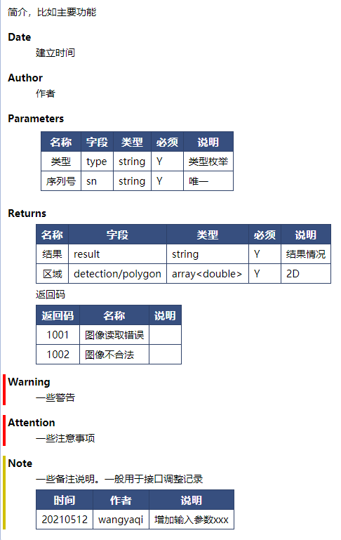

# doxygen
* 采用[Doxygen](https://blog.csdn.net/Candy1232009/article/details/80786179)编写C++文档
* [实例](https://github.com/andrewwang79/cpp.practice/tree/master/doxygen)

## 编写
### 函数定义
* 在函数前加，以下是API函数实例，参见https://github.com/andrewwang79/cpp.practice/blob/master/doxygen/DogService.h

```
/**
 * @brief  简介，比如功能说明
 * @date   2021.05.12
 * @author wangyaqi
 * @param
 * | 名称 | 字段 | 类型 | 必须 | 说明 |
 * | :-: | - | - | - | - |
 * | 类型 | type | string | Y | 类型枚举 |
 * | 序列号 | sn | string | Y | 唯一 |
 * @return
 * | 名称 | 字段 | 类型 | 必须 | 说明 |
 * | :-: | - | - | - | - |
 * | 结果 | result | string | Y | 结果情况 |
 * | 区域 | detection/polygon | array<double> | Y | 2D |
 * 返回码
 * | 返回码 | 名称 | 说明 |
 * | :-: | - | - |
 * | 1001 | 图像读取错误 |  |
 * | 1002 | 图像不合法 |  |
 * @warning   警告
 * @attention 注意事项
 * @note 备注说明。可用于函数修改记录
 * | 时间 | 作者 | 说明 |
 * | :-: | - | - |
 * | 20210.05.12 | wangyaqi | 增加输入参数xxx |
 */
 ```

* 效果



### 主页内容说明
* 在任意文件添加，参见https://github.com/andrewwang79/cpp.practice/blob/master/doxygen/main.cpp

```
/*! \mainpage 主页
# 简介
* 本内容显示在首页
* 简单的markdown格式，完全自定义
# Quick Start
一些使用说明。
*/
```

### 新增导航树页面
* 在项目里添加md文件，参见https://github.com/andrewwang79/cpp.practice/blob/master/doxygen/article.md

### 生成UML图
* 安装graphviz，确保以下参数。参考自https://blog.csdn.net/Cross_Entropy/article/details/117265884
```
EXTRACT_ALL            = YES
HAVE_DOT               = YES
UML_LOOK               = YES
```

## 构建
* 确保输入目录干净，不要有编译过程文件等！
* 通过配置文件[Doxyfile](https://github.com/andrewwang79/cpp.practice/blob/master/doxygen/Doxyfile.tpl)构建，可以使用变量替换，[脚本参考](https://github.com/andrewwang79/cpp.practice/blob/master/doxygen/gen.sh)

```
#!/bin/bash
set -e

if [ ! $# == 5 ]; then
  echo "usage : sh gen.sh 产品名 版本 输入待分析目录 输出文档目录 doxyfile模板文件"
  echo "example : sh gen.sh taihang 1.0.0.0 code doc Doxyfile.tpl"
  exit 0
fi

PRODUCT_NAME=$1
FULL_VERSION_NUM=$2
INPUT_DIRECTORY=$3
OUTPUT_DIRECTORY=$4
DOXYFILE_TPL=$5

apt-get install -y doxygen graphviz
DOXYFILE=$DOXYFILE_TPL.file
cp -f $DOXYFILE_TPL $DOXYFILE
sed -i "s#%productName%#${PRODUCT_NAME}#g" ${DOXYFILE}
sed -i "s#%fullVersionNum%#${FULL_VERSION_NUM}#g" ${DOXYFILE}
sed -i "s#%inputDirectory%#${INPUT_DIRECTORY}#g" ${DOXYFILE}
sed -i "s#%outputDirectory%#${OUTPUT_DIRECTORY}#g" ${DOXYFILE}

doxygen ${DOXYFILE}

rm $DOXYFILE
```
