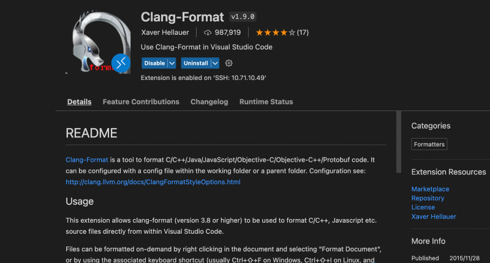
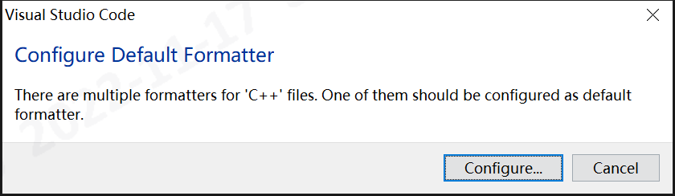
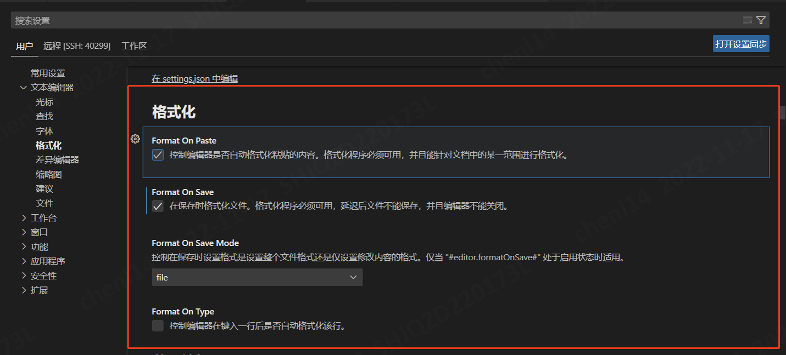
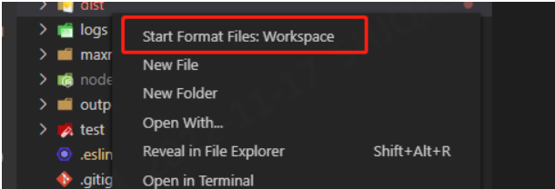
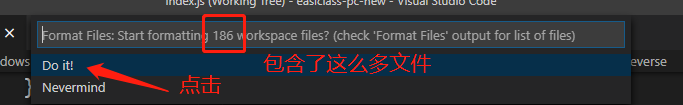
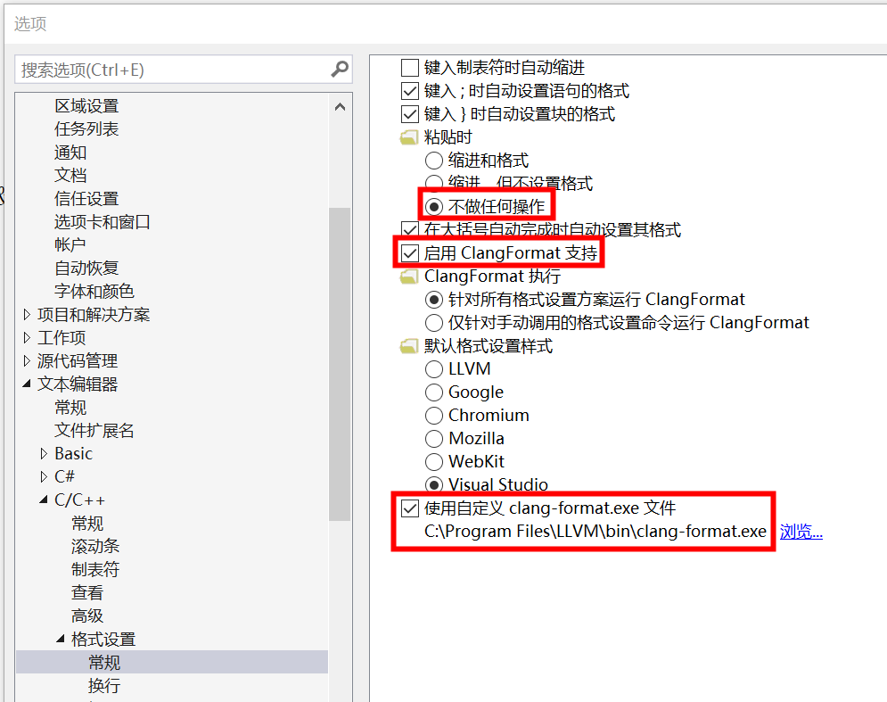

# 代码规范和格式化
## VsCode
* 格式化：安装插件"Clang-Format"，放置2个文件“.clang-format”和”.vscode/settings.json"
* [vscode批量格式化代码](https://blog.csdn.net/koukouwuwu/article/details/111879677) : 安装插件"Format Files"
* vscode配置：
  * 默认行尾字符(Files:Eol)设置成"\n"
  * 保存时自动格式化

### 使用clang-format格式化单个文件
1. 安装插件**Clang-Format**

1. 将文件**.clang-format**拷贝到工程根目录下  
1. 在打开的源代码下执行**Alt + shift + F**格式化源代码。当执行**Alt + shift + F**出现以下界面时，点击configuration配置默认的格式化工具。格式化程序有多个选项时,选择"**Clang-format**"

1. 在vscode 文件->首选项->设置->文本编辑器中打开**Format On Save**开关,每次save文件时会自动格式化代码  

1. 当保存时出现"The clang-format command is not available…"，下载并安装[LLVM-3.7.0-win32](http://llvm.org/releases/3.7.0/LLVM-3.7.0-win32.exe)

### 使用Format Files格式化目录下所有文件
1. 安装插件 Format Files  

1. 右键需要格式化的文件夹,选择“Start Format Files”  


1. 执行完毕,文件夹下的文件全部进行了格式化

## VisualStudio
1. 保存时自动格式化：安装插件"Format document on Save"(扩展 –> 管理扩展 –> 联机 –> 搜索)
1. 文件自动UTF8：安装插件"ForceUTF8(No BOM)"
1. 格式化有两种方法，推荐方法1:
    1. clang-format方法
    1. 内置方法：勾选：工具 -> 选项 -> 文本编辑器 -> C/C++ -> 格式设置 -> 默认格式设置样式 -> Google
1. clang-format方法
    1. [文件“.clang-format”放到项目根目录](https://blog.csdn.net/qq_33101873/article/details/121426522)，MSVC默认会使用项目目录下的文件".clang-format"。注意如果拷贝文件".clang-format"一定要在资源管理器里操作
    1. VisualStudio2017内置的clang-format版本6太低，需要重新安装
    1. 自定义exe到clang-format安装的路径(C:\Program Files\LLVM\bin\clang-format.exe)，详见下图红框
    

## clang-format
### 安装
* apt-get install clang-format // 安装
* [安装包下载页面](https://github.com/llvm/llvm-project/releases/tag/llvmorg-18.1.1)，Windows文件是[LLVM-18.1.1-win64.exe](https://github.com/llvm/llvm-project/releases/download/llvmorg-18.1.1/LLVM-18.1.1-win64.exe)
* clang-format --version // 确保所有环境(如Windows/Linux)使用的版本是一致的

### 使用方法
* [用法详解](https://zhuanlan.zhihu.com/p/641846308)
* [.clang-format文件常用参数](https://bugwz.com/2019/01/08/clang-format/)
* clang-format -i --style=file <file> // 手工格式化，可以看详细信息，查找问题时比较好用
* Windows下脚本 : Get-ChildItem "path\to\your\code" -Recurse -Include *.h, *.cpp | ForEach-Object { clang-format -i $_.FullName }

### 集成使用
* 头文件被其他头文件依赖，必须放在最上面，但是格式化后自动放下面了：通过备注或者加空换行把这个头文件放在最上面，和其他头文件隔离开
```
// FIRST_INCLUDES_BEGIN
#include "dependence.h"
// FIRST_INCLUDES_END
```

* 不需要.clang-format的代码块
```
 /* clang-format off */
 int a = 42;
 a++;
 ...
 /* clang-format on */
```

### 格式化文件
* .clang-format

```
# Run manually to reformat a file:
# clang-format -i --style=file <file>
# https://clang.llvm.org/docs/ClangFormatStyleOptions.html
# https://github.com/llvm/llvm-project/releases/tag/llvmorg-18.1.1

Language: Cpp
BasedOnStyle: Google
ColumnLimit: 200
AllowShortBlocksOnASingleLine: true
DerivePointerAlignment: false
PointerAlignment: Left
AllowShortEnumsOnASingleLine: false
IndentPPDirectives: BeforeHash # #ifdef
```

* .vscode/settings.json

```
{
    "clang-format.language.cpp.fallbackStyle": "Google",
    "clang-format.language.cpp.style": "file",
    "C_Cpp.clang_format_fallbackStyle": "Google",
    "C_Cpp.clang_format_style": "file",
    "C_Cpp.clang_format_sortIncludes": true,
    "editor.formatOnSave": true
}
```

* settings.json，自定义程序和配置文件

```
  "clang-format.executable": "/usr/bin/clang-format",
  "clang-format.path": "${workspaceFolder}/cicd/.clang-format"
```

## 资料
* [在 Visual Studio 中编辑和重构 C++ 代码](https://docs.microsoft.com/zh-cn/cpp/ide/writing-and-refactoring-code-cpp?view=msvc-170)
