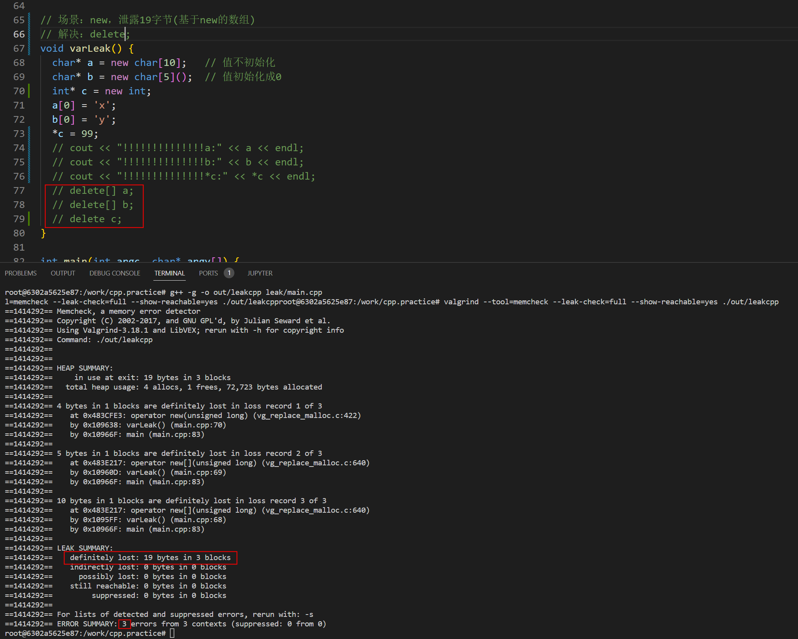

# valgrind
* valgrind模拟软CPU，程序运行在其中，所以执行速度会慢很多。
* [linux工具之检测内存泄漏-valgrind](https://blog.csdn.net/shixin_0125/article/details/78590796)
* https://www.valgrind.org/docs/manual/mc-manual.html
* [valgrind报告5种内存泄露的研究](https://blog.csdn.net/louObaichu/article/details/45507365)
* [still reachable](https://blog.csdn.net/louObaichu/article/details/45507365)
* [valgrind之内存调试](https://blog.csdn.net/miss_acha/article/details/19839715)

## 使用
```
memcheck工具分析 : valgrind -v --log-file=valgrind.log --tool=memcheck --leak-check=full --show-reachable=yes --show-mismatched-frees=yes ./a.out
```

## 使用事项
1. 打开调试模式（gcc编译器的-g选项）
1. 关闭编译优化选项



# heaptrack
* 堆内存分析工具 : https://github.com/KDE/heaptrack

# santizer