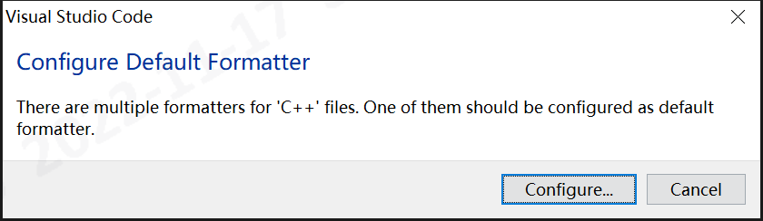
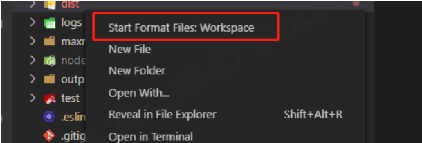
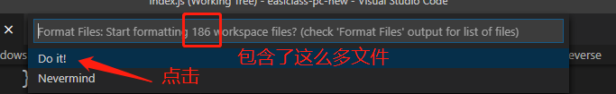

# vscode
## 插件
| 用途 | 名称 |
| - | - |
| 远程 | Remote - SSH |
| C++开发包 | C/C++ Extension Pack |
| 格式化 | Clang-Format |
| Java开发包 | Extension Pack for Java |
| Markdown查看 | Markdown Preview Enhanced |
| GIT | GitLens |

### Remote
* 在服务器目录/root/.vscode-server/，里面有log能看

### GitLens
* [取消每行后面代码变更记录](https://blog.csdn.net/z284949127/article/details/111297448)

## 远程开发
* [Windows下设置SSH免密](https://www.jianshu.com/p/06f3b2d1ebdc)
  1. Windows : ssh-keygen -t rsa
  1. Linux宿主机 : 把上一步生成文件"id_rsa.pub"的内容追加到文件"~/.ssh/authorized_keys"
  1. 首次需先用cmd登录，因为首次要交互式confirm: ssh user@192.168.1.99
* [ssh连接用的是windows用户名的解决](https://blog.csdn.net/LittleSeedling/article/details/120606054)
* 1个IP多端口时，不同端口需设置不同的昵称“Host”，注意Host不能有"ip:port"的写法。配置文件参考：

```
Host 192.168.1.27-CPP
  HostName 192.168.1.27
  Port 10101
  User root

Host 192.168.1.27-HOST
  HostName 192.168.1.27
  Port 22
  User user
```

## 调试
* 都在.vscode目录配置

### launch.json
```
# Linux调试程序配置
{
    "name": "XyzTest(Linux)",
    "type": "cppdbg",
    "request": "launch",
    "cwd": "${workspaceRoot}",
    "program": "${workspaceRoot}/build/bin/XyzTest",
    "args": [
        "a1"
    ],
    "preLaunchTask": "cp_config", # 自定义task，可以不用
    "stopAtEntry": false,
    "setupCommands": [
        {
            "text": "-enable-pretty-printing",
            "description": "enable pretty printing",
            "ignoreFailures": true
        }
    ]
}

# Windows调试程序配置
{
  "name": "XyzTest(Windows)",
  "type": "cppvsdbg",
  "request": "launch",
  "cwd": "${workspaceRoot}",
  "program": "${workspaceRoot}/build/bin/XyzTest.exe",
  "args": [
      "a1"
  ],
  "preLaunchTask": "cp_config", # 自定义task，可以不用
  "stopAtEntry": false,
  "environment": [
      {
          "name": "PATH",
          "value": "C:/third/lib/debug/" # 第三方库的目录，debug时可加载依赖库。Linux也可通过ldconfig加载
      }
  ]
}
```

### tasks.json
```
"command": "cmd1 ; cmd2"
```

### c_cpp_properties.json
```
# 头文件include目录配置
"includePath": [
    "${workspaceFolder}/**",
    "C:/third/include/**" # conan安装目录，Windows使用
    "/opt/third/include/**" # conan安装目录，Linux使用
]
```
cpp\s\third\vscode\codeFormat_0.png
## 代码格式化
### 使用clang-format格式化单个文件
1. 安装插件**Clang-Format**
    
1. 将文件**.clang-format**拷贝到工程根目录下  
1. 在打开的源代码下执行**Alt + shift + F**格式化源代码。当执行**Alt + shift + F**出现以下界面时，点击configuration配置默认的格式化工具。格式化程序有多个选项时,选择"**Clang-format**"
    
1. 在vscode 文件->首选项->设置->文本编辑器中打开**Format On Save**开关,每次save文件时会自动格式化代码  

1. 当保存时出现"The clang-format command is not available…"，下载并安装[LLVM-3.7.0-win32](http://llvm.org/releases/3.7.0/LLVM-3.7.0-win32.exe)

### 使用Format Files格式化目录下所有文件
1. 安装插件 Format Files  

1. 右键需要格式化的文件夹,选择“Start Format Files”  


1. 执行完毕,文件夹下的文件全部进行了格式化

## 资料
* [在VS Code中开启gdb的pretty-printer功能](https://blog.csdn.net/yanxiangtianji/article/details/80579236)
* 设置"Git: Autofetch" -> 选择false